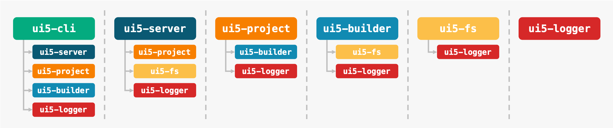

# UI5 Tooling
> An open and modular toolchain to develop state-of-the-art applications based on the [UI5](https://ui5.sap.com) framework.

## Resources
- [Documentation](https://sap.github.io/ui5-tooling/)
- [API Reference](https://sap.github.io/ui5-tooling/api/)
- [CLI Documentation](https://github.com/SAP/ui5-cli#cli-usage)
- [Project Configuration](https://github.com/SAP/ui5-project/blob/master/docs/Configuration.md)
- 🎬 [UI5con@SAP 2018 Talk](https://www.youtube.com/watch?v=iQ07oe26y_k)
- 🎬 [UI5con@SAP 2020 Talk](https://www.youtube.com/watch?v=8IHoVJLKN34)
- [Contribution Guidelines](./CONTRIBUTING.md)
- [Roadmap](https://github.com/SAP/ui5-tooling/issues/101)

## Modules
- [ui5-cli](https://github.com/SAP/ui5-cli): UI5 Command Line Interface, utilizing all of the following modules
- [ui5-server](https://github.com/SAP/ui5-server): Modules for running a UI5 development server
- [ui5-project](https://github.com/SAP/ui5-project): Modules for building a UI5 project's dependency tree, including configuration
- [ui5-builder](https://github.com/SAP/ui5-builder): Modules for building UI5 projects
- [ui5-fs](https://github.com/SAP/ui5-fs): UI5 specific file system abstraction
- [ui5-logger](https://github.com/SAP/ui5-logger): Internal logging module

**Usage Overview** *(arrows indicate dependencies)*

## Contributing
Please check our [Contribution Guidelines](https://github.com/SAP/ui5-tooling/blob/master/CONTRIBUTING.md).

## Support
Please follow our [Contribution Guidelines](https://github.com/SAP/ui5-tooling/blob/master/CONTRIBUTING.md#report-an-issue) on how to report an issue. Or chat with us in the [`#tooling`](https://openui5.slack.com/archives/C0A7QFN6B) channel of the [OpenUI5 Community Slack](https://ui5-slack-invite.cfapps.eu10.hana.ondemand.com/)
