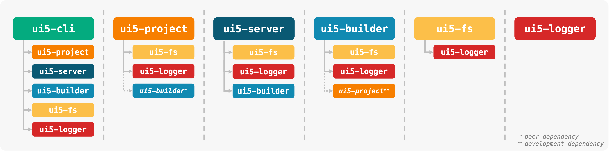

# UI5 Tooling

> An open and modular toolchain to develop state-of-the-art applications based on the [UI5](https://ui5.sap.com) framework.

## Deprecation

> [UI5 Tooling v3](https://sap.github.io/ui5-tooling/v3) is the latest and stable version 🎉

> [UI5 Tooling v2](https://sap.github.io/ui5-tooling/v2) has been deprecated 🚫

> Please migrate your projects to [UI5 Tooling v3](https://sap.github.io/ui5-tooling/v3/updates/migrate-v3/)!

The reason to deprecate **UI5 Tooling Version 2** and enforce the migration to **UI5 Tooling Version 3** is rooted in our efforts to allow the usage of the latest ECMAScript syntax in the UI5 framework. OpenUI5 and SAPUI5 libraries will make use of modern ECMAScript syntax up to and including "ES2022". UI5 Tooling comes with comprehensive [ECMAScript support](https://sap.github.io/ui5-tooling/v3/pages/ESSupport/) only with Version 3. 

Beginning with releases of **OpenUI5** and **SAPUI5 1.116**, UI5 Framework libraries will start using modern ECMAScript syntax and define **"Specification Version 3.0"** in their UI5 Tooling configuration. 

If you are using UI5 Tooling in your projects, this means you will have to upgrade to UI5 Tooling Version 3. 

If you are using additional build scripts or UI5 Tooling extensions, you should ensure their support for ECMAScript 2022. 

## Resources
- [Documentation v2](https://sap.github.io/ui5-tooling/v2/)
- [API Reference v2](https://sap.github.io/ui5-tooling/v2/api/)
- [CLI Documentation v2](https://sap.github.io/ui5-tooling/v2/pages/CLI/)
- [Project Configuration v2](https://sap.github.io/ui5-tooling/v2/pages/Configuration/)
- 🎬 [UI5con@SAP 2018 Talk](https://www.youtube.com/watch?v=iQ07oe26y_k)
- 🎬 [UI5con@SAP 2020 Talk](https://www.youtube.com/watch?v=8IHoVJLKN34)
- [Contribution Guidelines](https://github.com/SAP/ui5-tooling/blob/master/CONTRIBUTING.md)
- [Roadmap](https://github.com/SAP/ui5-tooling/issues/101)

## Modules
UI5 Tooling consists of multiple modules. Each one is managed in a separate repository:

- [ui5-cli](https://github.com/SAP/ui5-cli): UI5 Command Line Interface, utilizing all of the following modules
- [ui5-project](https://github.com/SAP/ui5-project): Modules for building a UI5 project's dependency tree, including configuration
- [ui5-server](https://github.com/SAP/ui5-server): Modules for running a UI5 development server
- [ui5-builder](https://github.com/SAP/ui5-builder): Modules for building UI5 projects
- [ui5-fs](https://github.com/SAP/ui5-fs): UI5 specific file system abstraction
- [ui5-logger](https://github.com/SAP/ui5-logger): Internal logging module

**Usage Overview** *(arrows indicate dependencies)*

## Contributing
Please check our [Contribution Guidelines](https://github.com/SAP/ui5-tooling/blob/master/CONTRIBUTING.md).

## Support
Please follow our [Contribution Guidelines](https://github.com/SAP/ui5-tooling/blob/master/CONTRIBUTING.md#report-an-issue) on how to report an issue. Or chat with us in the [`#tooling`](https://openui5.slack.com/archives/C0A7QFN6B) channel of the [OpenUI5 Community Slack](https://ui5-slack-invite.cfapps.eu10.hana.ondemand.com/). For public Q&A, use the [`ui5-tooling` tag on Stack Overflow](https://stackoverflow.com/questions/tagged/ui5-tooling).
