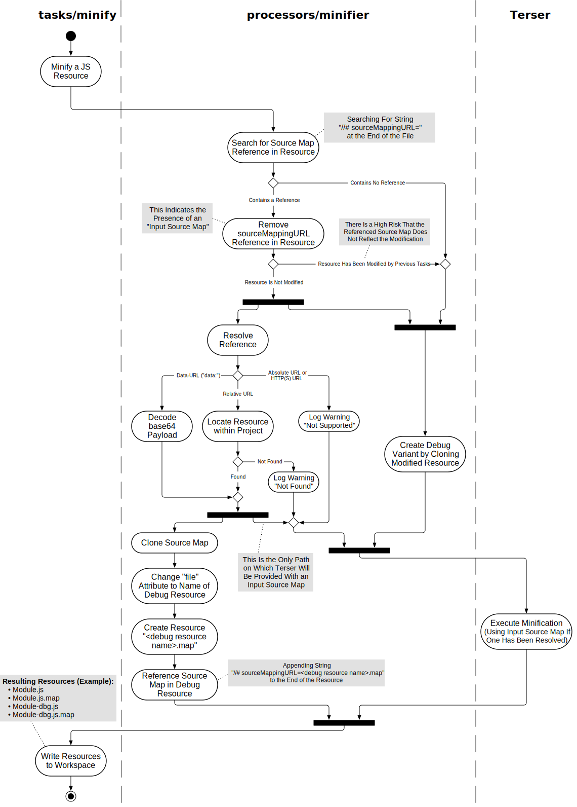

# UI5 Builder

The [UI5 Builder](https://github.com/SAP/ui5-builder) module takes care of building your project.

Based on a project's type, the UI5 Builder defines a series of build steps to execute; these are also called "tasks".

For every type there is a set of default tasks. You can disable single tasks using the `--exclude-task` [CLI parameter](./CLI.md#ui5-build), and you can include tasks using the `--include-task` parameter.

[**API Reference**](https://sap.github.io/ui5-tooling/v4/api/index.html){: .md-button .sap-icon-initiative }

## Tasks
Tasks are specific build steps to be executed during build phase.

They are responsible for collecting resources which can be modified by a processor. A task configures one or more processors and supplies them with the collected resources. After the respective processor processed the resources, the task is able to continue with its workflow.

A project can add custom tasks to the build by using the [Custom Tasks Extensibility](./extensibility/CustomTasks.md).

### Standard Tasks

All available standard tasks are documented [in the API reference](https://sap.github.io/ui5-tooling/v4/api/index.html). Search for `@ui5/builder/tasks/` to filter the API reference for all available tasks. The list below offers the actual order of their execution:

| Task                      | Type `application` | Type `library` | Type `theme-library` |
| ------------------------- | :----------------: | :------------: | :------------------: |
| escapeNonAsciiCharacters  | *enabled*          | *enabled*      |                      |
| replaceCopyright          | *enabled*          | *enabled*      | *enabled*            |
| replaceVersion            | *enabled*          | *enabled*      | *enabled*            |
| replaceBuildtime          |                    | *enabled*      |                      |
| generateJsdoc             |                    | *disabled* ^1^ |                      |
| executeJsdocSdkTransformation |                | *disabled* ^1^ |                      |
| minify                    | *enabled*          | *enabled*      |                      |
| generateFlexChangesBundle |                    | *enabled*      |                      |
| generateLibraryManifest   |                    | *enabled*      |                      |
| generateComponentPreload  | *enabled*          | *disabled* ^2^ |                      |
| generateLibraryPreload    |                    | *enabled*      |                      |
| generateStandaloneAppBundle | *disabled* ^3^   |                |                      |
| transformBootstrapHtml    | *disabled* ^3^     |                |                      |
| generateBundle            | *disabled* ^4^     | *disabled* ^4^ |                      |
| buildThemes               |                    | *enabled*      | *enabled*            |
| generateThemeDesignerResources |               | *disabled* ^5^ | *disabled* ^5^       |
| generateVersionInfo       | *disabled* ^1^     |                |                      |
| generateCachebusterInfo   | *disabled*         |                |                      |
| generateApiIndex          | *disabled* ^1^     |                |                      |
| generateResourcesJson     | *disabled*         | *disabled*     | *disabled*           |

*Disabled tasks can be activated by certain build modes, the project configuration, or by using the `--include-task` [CLI parameter](./CLI.md#ui5-build). See footnotes where given*

---

^1^ Enabled in `jsdoc` build, which disables most of the other tasks  
^2^ Enabled for projects defining a [component preload configuration](./Configuration.md#component-preload-generation)  
^3^ Enabled in `self-contained` build, which disables `generateComponentPreload` and `generateLibraryPreload`  
^4^ Enabled for projects defining a [bundle configuration](./Configuration.md#custom-bundling)  
^5^ Can be enabled for framework projects via the `includeTask` option. For other projects, this task is skipped

### minify

The `minify` task compresses all JavaScript resources of a project while preserving the original sources as so-called **debug variants**. For example when compressing a resource named `Module.js`, its content will be [minified](https://developer.mozilla.org/en-US/docs/Glossary/Minification) and a new resource `Module-dbg.js` is created and placed next to it.

The UI5 runtime can be instructed to load those debug variants instead of compressed resources and bundles. This can ease debugging in some cases, since the original sources are then used directly in the browser. For details, refer to the [UI5 framework documentation on debugging](https://ui5.sap.com/#/topic/c9b0f8cca852443f9b8d3bf8ba5626ab%23loioc9b0f8cca852443f9b8d3bf8ba5626ab).

For each resource it compresses, the `minify` task will also create a [**source map**](https://firefox-source-docs.mozilla.org/devtools-user/debugger/how_to/use_a_source_map/index.html) resource. Browsers can use this to map the content of a compressed JavaScript resource back to the original source file (now contained in the debug variant). All this happens automatically once you open the development tools in the browser and start debugging a project. While the browser still executes the code of the compressed resources, it will also show the debug variants and use the source maps to connect the two. This results in an improved debugging experience, which is almost identical to loading the debug variants directly as described before, only much faster.

Related to this, the bundling tasks will also incorporate the generated source maps to map the content of the bundles to the individual debug variants of the bundled modules.

#### Input Source Maps

!!! info
	Support for input source maps has been added in UI5 CLI [`v3.7.0`](https://github.com/SAP/ui5-cli/releases/tag/v3.7.0).

For projects facilitating transpilation (such as TypeScript-based projects), it is commonly desired to debug in the browser using the original sources, e.g. TypeScript files. To make this work, the transpilation process first needs to create source maps and reference them in the generated JavaScript code.

UI5 Tooling's `minify` task will then find this reference and incorporate the source map into the minification process. In the end, the minified JavaScript resources will reference an updated source map, which reflects the transpilation as well as the minification. The browser can use this to map every statement back to the original TypeScript file, making debugging a breeze.

!!! warning
    If a resource has been modified by another build task before `minify` is executed, any referenced source map will be ignored. This is to ensure the integrity of the source maps in the build result.

    It is possible that the modification of the resource content is not reflected in the associated source map, rendering it corrupted. A corrupt source map can make it impossible to properly analyze and debug a resource in the browser development tools.

    Standard tasks which may modify resources without updating the associated source maps currently include `replaceVersion`, `replaceCopyright` and `replaceBuildtime`.

Expand the block below to view a diagram illustrating the minification process and source map handling.

??? info "Minification Activity Diagram"
    { loading=lazy }

## Processors
Processors work with provided resources. They contain the actual build step logic to apply specific modifications to supplied resources, or to make use of the resources' content to create new resources out of that.

Processors can be implemented generically. The string replacer is an example for that.
Since string replacement is a common build step, it can be useful in different contexts, e.g. code, version, date, and copyright replacement. A concrete replacement operation could be achieved by passing a custom configuration to the processor. This way, multiple tasks can make use of the same processor to achieve their build step.

To get a list of all available processors, please visit [the API reference](https://sap.github.io/ui5-tooling/v4/api/index.html) and search for `@ui5/builder/processors/`.

## Legacy Bundle Tooling (lbt)
JavaScript port of the "legacy" Maven/Java based bundle tooling.
