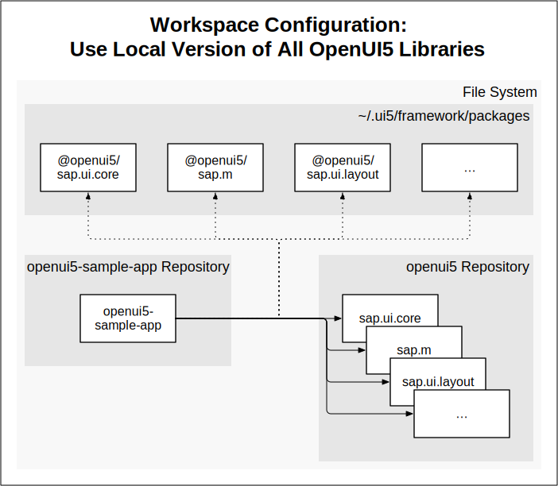
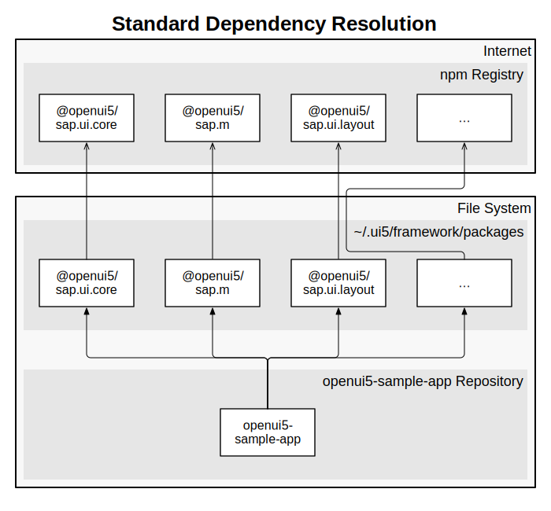

- Start Date: 2019-06-11
- RFC PR: [#157](https://github.com/SAP/ui5-tooling/pull/157)
- Issue: -
- Affected components
    + [ ] [ui5-builder](https://github.com/SAP/ui5-builder)
    + [ ] [ui5-server](https://github.com/SAP/ui5-server)
    + [X] [ui5-cli](https://github.com/SAP/ui5-cli)
    + [ ] [ui5-fs](https://github.com/SAP/ui5-fs)
    + [X] [ui5-project](https://github.com/SAP/ui5-project)
    + [ ] [ui5-logger](https://github.com/SAP/ui5-logger)


# RFC 0006 Local Dependency Resolution

## Summary
It should be possible to easily and reliably work with locally cloned UI5 apps and libraries. 

This should work on top of the already existing npm dependency resolution.

## Motivation
Currently working with local npm/yarn links is hard:
- Initial linking setup needs to be executed in the right order
    - Becomes more and more complex when working with a lot of different repositories
- Links may disappear when doing npm installs
- yarn and npm links can't be mixed
- Linking can be automated with scripts, but requires knowledge about the location of projects

**Use cases:**
- Local OpenUI5 library development (no external dependencies)
- Local app development against local OpenUI5 libraries
- Local app development against local reuse library

By using "UI5 Workspaces", it should be possible to use dependencies from local folders without the need to use the npm/yarn link feature.

The required initial steps and configuration should be as minimal and easy as possible.

It should be possible to provide a project setup with all necessary configuration so that no extra steps from the developer are required in order to use it (i.e. npm install && ui5 serve -o).

It should be up to the project to decide whether this configuration is part of the project files (tracked via SCM) or individual configuration per developer.

It should be possible to use local copies of selected dependencies, while others are consumed via the standard node_modules resolution.

## Detailed design

### Workspace Configuration File

A new kind of configuration file should be introduced, allowing to define "UI5 Workspaces". In a first step, and to address the key purpose of this RFC, this configuration shall allow for influencing the dependency resolution when working with a UI5 project.

For this, it should be possible to define locations at which UI5 Tooling will look for a dependency first, before falling back to the regular dependency resolution.

#### Example: Overwrite Resolution of a Single Library

```yaml
# ui5-workspace.yaml
specVersion: workspace/1.0
metadata:
    name: local-core
dependencyManagement:
    resolutions:
        - path: ../openui5/src/sap.ui.core
```

By configuring an additional resolution path, pointing to the directory of the sap.ui.core package within the OpenUI5 development repository, that package will be used instead of the one retrieved from the npm repository:


#### Example: Overwrite Resolution of a Multiple Libraries

```yaml
# ui5-workspace.yaml
specVersion: workspace/1.0
metadata:
    name: local-openui5
dependencyManagement:
    resolutions:
        - path: ../openui5
```

For resolving all modules in OpenUI5, it should be enough to provide a path to the root directory. UI5 Tooling shall then use the [npm workspaces](https://docs.npmjs.com/cli/v8/using-npm/workspaces) configuration in the [package.json](https://github.com/SAP/openui5/blob/b74d3c2f153d7a23a2c9b914280b14b7289d7880/package.json#L128) to resolve all libraries located in the repository. Alternatively, an equivalent `ui5.workspaces` configuration in the package.json can be used. If a `ui5.workspaces` configuration is found, the standard npm workspace configuration shall be ignored.



```jsonc
// package.json in OpenUI5 repository root directory
{
  "name": "openui5",
  // [...]
  "workspaces": [
    "src/!(testsuite-utils)"
  ]
}
```

#### Example: Standard Dependency Resolution

For reference, this is how a standard dependency resolution, without a workspace configuration looks like. Dependencies of the openui5-sample-app are retrieved from the npm registry, stored in a central directory on the file system and used from there:



#### Example: Multiple Workspace Configurations

Since every workspace configuration is identifiable by a name, multiple workspaces can be configured in the same file:

```yaml
specVersion: workspace/1.0
metadata:
    name: local-core
dependencyManagement:
    resolutions:
        - path: ../openui5/src/sap.ui.core
---
specVersion: workspace/1.0
metadata:
    name: local-openui5
dependencyManagement:
    resolutions:
        - path: ../openui5
```

#### Workspace Names

Workspace names should be restricted in a reasonable matter (max length, only selected special characters). In addition, there shall be reserved names with special functionality:
* `default`: This workspace should always be used, even if no `--workspace` parameter is provided to the CLI
* _~`dev`: This workspace should always be used **unless**:~_
    - _~there is a `default` workspace configured~_
    - _~a production or CI environment is detected: **TODO: How?**~_

### Key Design Decisions

1. There can only be one active workspace at a time. Workspaces can not be combined (to be discussed)
2. Default configuration file name and format is `ui5-workspace.yaml`. A different filename can be used by passing a parameter `--workspace-config workspace.yaml` to the UI5 CLI. The ui5-project Node.js API shall accept a JSON.
1. If no `--workspace-config` parameter is given, UI5 Tooling shall search for a file named `ui5-workspace.yaml` in the current directory and in the directory of the `ui5.yaml` in use. UI5 Tooling shall never use more than one workspace configuration files.
1. (Optional) To make workspace configurations reusable across projects, it should be possible to reference a workspace configuration located in an npm dependency. An additional parameter `--workspace-config-module` should allow for providing the name of an npm dependency which contains one or multiple workspace configurations. For example: `--workspace-config-module my-ui5-workspace-config-module --workspace-config workspace.yaml`
1. Requested dependency versions do not matter (we may warn the user in some cases though)
    * For example, when using a local version of OpenUI5 through a workspace configuration of a project, the OpenUI5 version specified in the ui5.yaml of that project should be ignored. In the future, UI5 Tooling might detect potential issues when using cominations of framework libraries in different versions and warn the user.
1. Workspace configuration **must not** be located in a ui5.yaml. If workspace configuration is found in a ui5.yaml, this should cause an error.

**Dependency resolution configuration**
1. All paths must point to a directory
1. Symlinks are followed
1. (Optional) Dependency resolution paths must be relative paths. Absolute paths, or paths relative to the home directory (`~`), are not allowed. This is to ensure that workspace configuration files are easy to share and to reduce the chance of them containing private information like usernames or large directory hierarchies.

### UI5 CLI Enhancements

UI5 CLI should allow to choose any workspace (or none) using a parameter like `ui5 server --workspace local-openui5`. To disable the use of implicit workspaces like "default", a parameter `--no-workspace` should be provided.

In the future, additional CLI commands like `ui5 workspace create`, `ui5 workspace add ../openui5/src/sap.ui.core local-core`, etc. should make it easier for users to create and configure UI5 Workspaces.

Commands like `ui5 workspace list` and `ui5 workspace describe <workspace>` should help working with workspaces. One lists all available workspaces by name, the other describes the configuration of a given workspace.

## Examples
### Example A
```
my-awesome-app/
    \_ package.json
    \_ ui5-workspace.yaml
my-awesome-library/
    \_ package.json
```

**Use case:**
- my-awesome-app should use my-awesome-library  
    *my-awesome-app/ui5-workspace.yaml*
    ```yaml
    specVersion: workspace/1.0
    metadata:
        name: "local-dev"
    dependencyManagement:
        resolutions:
            - path:  ../my-awesome-library
    ```


### Example B
```
my-awesome-app/ (depends on sap.ui.core, sap.m and my-awesome-library)
    \_ package.json
    \_ ui5-workspace.yaml
my-awesome-library/ (depends on sap.ui.table)
    \_ package.json
    \_ ui5-workspace.yaml
openui5/
    \_ package.json
    \_ src/
        \_ sap.ui.core/
            \_ package.json
        \_ sap.m/
            \_ package.json
        \_ sap.ui.table/
            \_ package.json
        \_ testsuite/
            \_ package.json
            \_ ui5-workspace.yaml
```

**Use case:**
1. All my-awesome-app and my-awesome-library dependencies should be resolved locally
    - Solved with workspace configurations in both projects:  
        *my-awesome-app/ui5-workspace.yaml*
        ```yaml
        specVersion: workspace/1.0
        metadata:
            name: openui5
        dependencyManagement:
            resolutions:
                - path: ../openui5
                - path: ../my-awesome-library 
        ```

        *my-awesome-library/ui5-workspace.yaml*
        ```yaml
        specVersion: workspace/1.0
        metadata:
            name: openui5
        dependencyManagement:
            resolutions:
                - path: ../openui5
        ```
1. OpenUI5 testsuite should resolve all dependencies within the repository
    - Solved with default workspace configuration in testsuite  
        *openui5/src/testsuite/ui5-workspace.yaml*
        ```yaml
        specVersion: workspace/1.0
        metadata:
            name: default
        dependencyManagement:
            resolutions:
                - path: ../../
        ```

## How we teach this
### Terminology

* UI5 Workspace: A configured environment to use when working with a UI5 Project

### Documentation

* Update [Development Guide](https://sap.github.io/ui5-tooling/pages/Overview/)
* How-To guide for local development

## Drawbacks
### Transitive Dependency Resolution for Framework Projects

This concept overrides the path from which single projects are used. However, in case of **SAPUI5 framework libraries,** it can't resolve dependencies that are only declared in the workspace version of the library.

**Example:** Given a project with a dependency to framework library `sap.m` in version `1.108.0`. When overriding the resolution of `sap.m` to a local copy, which defines an additional dependency to another framework library like `sap.ui.codeeditor` in its package.json (or ui5.yaml for SAPUI5 libraries), that dependency might not be available and an error will be thrown.

Such cases can be resolved by temporarily adding the missing library to the dependencies of the root project. In general, once a dependency is part of the "normal" dependency graph of the project, it can also be referenced by projects resolved via workspace resolutions.

## Alternatives

* [npm linking](https://docs.npmjs.com/cli/v8/commands/npm-link)

## Unresolved Questions and Bikeshedding
*This section should be removed (i.e. resolved) before merging*

