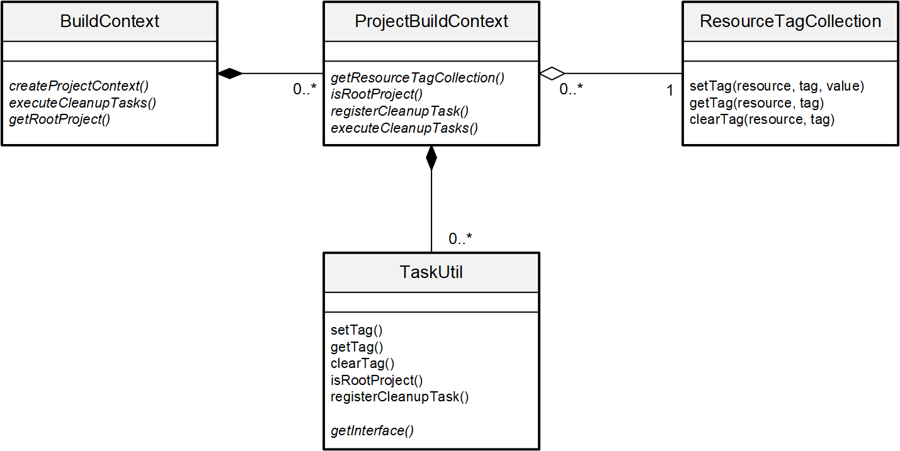

- Start Date: 2020-07-15
- RFC PR: [#243](https://github.com/UI5/cli/pull/243)
- Issue: Related to https://github.com/SAP/ui5-fs/issues/155
- Affected components <!-- Check affected components by writing an "X" into the brackets -->
    + [x] [ui5-builder](https://github.com/SAP/ui5-builder)
    + [ ] [ui5-server](https://github.com/SAP/ui5-server)
    + [ ] [ui5-cli](https://github.com/SAP/ui5-cli)
    + [x] [ui5-fs](https://github.com/SAP/ui5-fs)
    + [ ] [ui5-project](https://github.com/SAP/ui5-project)
    + [ ] [ui5-logger](https://github.com/SAP/ui5-logger)


# RFC 0008 Resource Tagging During Build

## Summary
Provide a functionality to store simple information for a resource during the build process. This information should be accessible to all build tasks and a small set of follow up tasks.

## Motivation
This concept was initially created as a solution for the requirement stated in [SAP/ui5-fs#155](https://github.com/SAP/ui5-fs/issues/155) for an "API to remove resources". Which in turn was created based on a use case of the UI5 Flexibility Area, which would like to remove resources *from the build result*.

Since *removing* resources is not trivial due to the layered structure of the "workspace" [DuplexCollection](https://ui5.github.io/cli/v2/api/module-@ui5_fs.DuplexCollection.html), a resource might have multiple sources and should not be removed from all of them. A tagging mechanism that rather focuses on the handling of a resource, e.g. that it should not be included into the build result, seems better suited to solve the above use case.

There are also other use cases for such a tagging mechanism. For example it would be useful for some tasks to know whether a resource should not be minified (e.g. some bundles).

This solution should not be used to store AST or dependency information of a resource in order to make that sharable across build tasks. A new Resource API shall be created to cover these information, as they fully depend on a resource's content and are not directly related to a resource's path.

## Detailed design

<!-- This is the bulk of the RFC. Explain the design in enough detail for somebody familiar with the UI5 CLI to understand, and for somebody familiar with the implementation to implement. This should get into specifics and corner-cases, and include examples of how the feature is used. Any new terminology should be defined here. -->

Introduce a new class "ResourceTagCollection" in ui5-fs which allows setting, clearing and getting of tag values for a resource. An instance of this class should be created and exposed in the [ProjectBuildContext](https://github.com/SAP/ui5-builder/blob/4e75d4dc7a1d74a0fa21bb45928f07eec25dd353/lib/builder/BuildContext.js#L42). With that the lifecycle of the tags is limited to that of a single project build.  
In the future, some tags might be shared across all projects (via [BuildContext](https://github.com/SAP/ui5-builder/blob/4e75d4dc7a1d74a0fa21bb45928f07eec25dd353/lib/builder/BuildContext.js#L7)). Currently we are not aware of any use case for this.

Tags are stored with a given resource's virtual path as key. This makes changes to a resource's tags easy as there is no need to write the resource back to the adapter in order to persist those changes.

Tasks can set and get tags via a new "TaskUtil" class which provides a specVersion dependent interface per (custom-) task. Its API basically wraps that of the ResourceTagCollection instance of the ProjectBuildContext.



### Tags
**Standard tags shall be provided as a constant on the ProjectBuildContext/TaskUtil:**
```js
buildContext.STANDARD_TAGS = {
    OmitFromBuildResult: "ui5:OmitFromBuildResult"
};
```

JSDoc for this constant shall document that the OmitFromBuildResult tag must be set to `true`.

Tags shall follow a naming convention `<namespace>:<TagName>`. Namespaces `sap`, `ui5`, `core`, `sapui5`, `openui5` shall be reserved for standard tags provided by the UI5 CLI. No other tags are allowed to use these namespaces. The namespace must be alphanumeric, all lowercase and start with a letter (no number). The tag name must be alphanumeric, camel case and start with a capital letter (no number).

Initially, tagging shall be restricted to the use of the standard tags defined by the UI5 CLI.  
In the future, custom tasks shall be enabled to use self-defined tags for the purpose of communicating per-resource information between tasks. These tags must follow the naming conventions and restrictions outlined above.

### New APIs in Detail

The task facing API shall be wrapped in a new class "TaskUtil". Similarly to the [MiddlewareUtil](https://ui5.github.io/cli/v2/api/module-@ui5_server.middleware.MiddlewareUtil.html) of the UI5 Server, it should provide a [specVersion-dependent interface](https://github.com/SAP/ui5-server/blob/v2/lib/middleware/MiddlewareUtil.js#L21) to convenience functions as well as the new tagging APIs.

An instance of TaskUtil will be passed to every standard task that requires it. To stay compatible for current consumers of those tasks, the new parameter must be treated as optional.

Custom tasks that define a specification version >= 2.2 will receive an interface to an instance of this class when called. The set of available functions on that interface depends on the specification version defined for the extension.

**Example usage:**
```js
const {OmitFromBuildResult} = taskUtil.STANDARD_TAGS;
taskUtil.setTag(resource, OmitFromBuildResult, true);
taskUtil.clearTag(resource, OmitFromBuildResult);
taskUtil.getTag(resource, OmitFromBuildResult);
```

#### TaskUtil#setTag(resource, tagName, value)

* The resource must be of type [@ui5/fs.Resource](https://ui5.github.io/cli/v2/api/module-@ui5_fs.Resource.html)
* Throws an error if the tag name does not follow the naming conventions and restrictions outlined [above](#tags)
* Value must be primitive. If no value is supplied, it defaults to true (hence can't be undefined)
* Returns undefined

#### TaskUtil#clearTag(resource, tagName)

* Removes the tag
* Does **not** throw if the tag is not set for the given resources
* Throws an error if the tag name does not follow the naming conventions and restrictions outlined [above](#tags)
* Returns undefined

#### TaskUtil#getTag(resource, tagName)

* Returns value of the tag (as set via setTag)
* Returns undefined if tag not set
* Throws an error if the tag name does not follow the naming conventions and restrictions outlined [above](#tags)

### New minor specVersion

A new specVersion needs to be added to allow custom tasks to use the ProjectBuildContext.

Only the specVersion needs to be bumped to the next minor version.
There are no configuration changes in the ui5.yaml / schema.

## How we teach this

<!--
What names and terminology work best for these concepts and why? How is this idea best presented?

Would the acceptance of this proposal mean the UI5 CLI or any of its subcomponents documentation must be re-organized or altered?

How should this feature be introduced and taught to existing UI5 CLI users?
-->

Updated UI5 CLI documentation:

* JSDoc for TaskUtil class
* Update the custom task example to include the taskUtil parameter, however state that this is just some optional API that can be used if there is a need to (see [Drawbacks](#drawbacks)).

## Drawbacks

<!--
Why should we not do this? Please consider the impact on teaching people to use the UI5 CLI, on the integration of this feature with existing and planned features, on the impact of churn on existing users.

There are tradeoffs to choosing any path, please attempt to identify them here.
-->

This enhancement is an opt-in for tasks to make use of that new API / functionality. There is no need for any changes within existing tasks.
However it increases the complexity of the custom task API by adding a new entity that needs to be described and understood.
To ensure that tasks can be executed independently from the UI5 build (i.e. direct function call), the new `taskUtil` parameter must be optional. This might make the task implementation more complex.

It does not have an impact for most of the UI5 CLI users, so there are no major drawbacks expected.

Dependencies can be tagged, but might have already been processed. Therefore, depending on the tag, the desired effect might not occur.

## Alternatives

<!--
What other designs have been considered? What is the impact of not doing this?
-->

As outlined in the [Motivation](#motivation), an actual `remove` function could be added to the [ReaderCollection](https://ui5.github.io/cli/v2/api/module-@ui5_fs.ReaderCollection.html) or [DuplexCollection](https://ui5.github.io/cli/v2/api/module-@ui5_fs.DuplexCollection.html) classes. However, due to the layered structure of ui5-fs, it needs to be decided whether `remove` should actually remove a resource from its source or just ignore it at a higher level. Removing from source might not be intended. Ignoring a resource on a higher level could cause confusion since it might not be ignored when asking a different ReaderCollection for it.

## Unresolved Questions and Bikeshedding

<!--
*This section should be removed (i.e. resolved) before merging*

Optional, but suggested for first drafts. What parts of the design are still TBD? Are there any second priority decisions left to be made?
-->

Currently none.
