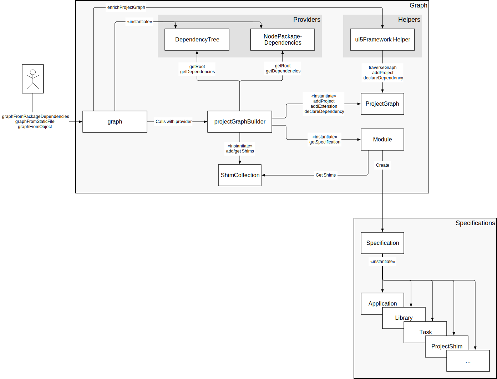
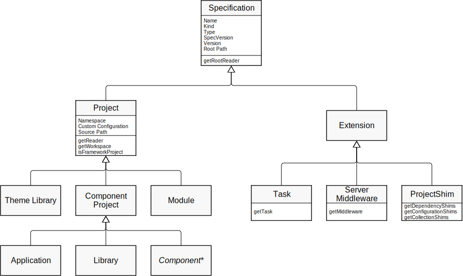

- Start Date: 2020-02-23
- RFC PR: https://github.com/SAP/ui5-tooling/pull/501
- Issue: -
- Affected components <!-- Check affected components by writing an "X" into the brackets -->
    + [x] [ui5-builder](https://github.com/SAP/ui5-builder)
    + [x] [ui5-server](https://github.com/SAP/ui5-server)
    + [x] [ui5-cli](https://github.com/SAP/ui5-cli)
    + [x] [ui5-fs](https://github.com/SAP/ui5-fs)
    + [x] [ui5-project](https://github.com/SAP/ui5-project)
    + [ ] [ui5-logger](https://github.com/SAP/ui5-logger)


# RFC 0009 UI5 Project Refactoring

## Summary
Refactor the ui5-project module to resolve a series of issues with the way dependencies are currently detected and analyzed as well as to provide a "Project" class entity, which can provide useful API for UI5 CLI internal processes as well as for custom tasks and -middleware.

## Motivation
<!-- Why are we doing this? What use cases does it support? What is the expected outcome?

Please focus on explaining the motivation so that if this RFC is not accepted, the motivation could be used to develop alternative solutions. In other words, enumerate the constraints you are trying to solve without coupling them too closely to the solution you have in mind.
-->

The following is a list of issues and requirements that the proposed refactoring should focus on. Note that for some topics additional changes in other modules are required. However, ui5-project often needs to provide the necessary prerequisites to enable these follow-up changes.

### Issues

1. ["JavaScript heap out of memory" error when declaring the UI5 CLI as a "dependency"](https://github.com/SAP/ui5-tooling/issues/311)
    * Improve detecting relevant dependencies and/or building the dependency tree
1. [Fix handling of circular dependencies between UI5 projects](https://github.com/SAP/ui5-tooling/issues/312)
1. [UI5 CLI modules might use different installations/instances of each other](https://github.com/SAP/ui5-tooling/issues/302)
    * Affected modules:
        * addTask API of `taskRepository`
        * addMiddleware API of  `middlewareRepository`
        * ui5-project access of `typeRepository` *(could use different formatter than builder)*
    * Example scenario:
        * A Node.js script `build-module` orchestrates the build of a UI5 project by using the offered Node.js API:
            * `build-module` requests a dependency tree from `@ui5/project v2.2.0` which internally adds custom tasks to the task repository `@ui5/builder v2.2.0`
            * `build-module` then supplies that dependency tree to `@ui5/builder v2.1.0` (different module), which can't find the custom tasks referenced in the dependency tree
    * Ideally, ui5-project should not depend on ui5-builder and ui5-server

### Requirements

1. Analyze `devDependencies` listed in the package.json by default
    * Custom middleware is typically referenced as a `devDependency` and should be detected by default
1. Make `ui5: {dependencies: [...]}` workaround in package.json obsolete
    * Currently required in projects with lots of transitive dependencies or to force UI5 CLI into analyzing a `devDependency`
1. [Access package.json in custom task](https://github.com/SAP/ui5-tooling/issues/360)
    * Have a "Project" entity providing an API for such use cases
1. Introduce easier maintainability of specification version updates
1. "Formatters" should already access project resources via the `@ui5/fs` abstraction layer
    * Currently they use the native file system layer. This caused addional efforts while working on the ZipArchiveAdapter PoC
1. Option to access resources of a project (typically the root project) in a "flat" (namespace-less) way ([related issue](https://github.com/SAP/ui5-tooling/issues/507))

## Detailed design

### Replace the Current Dependency Tree Generation Approach

**First** replace the dependency tree with an actual graph:

Currently all project information, including its configuration and dependencies, are stored in one big JSON object. This object is returned from the `@ui5/project.normalizer` module and then passed to either `@ui5/builder.builder` or `@ui5/server.server` where it is used to generate `@ui5/fs`-readers for all projects and to start working with them. While this keeps some things simple, there are several drawbacks with this approach.

A graph represents the structure of a typical UI5 project and its dependencies way better. It makes deduplication operations superfluous because you can't add the same node twice. Also, detecting problematic cyclic dependencies becomes very easy.

**Secondly**, the process of gathering all dependencies for a given project and analyzing them for their relevance should be merged into a single operation:

As of today, a [translator](https://sap.github.io/ui5-tooling/v2/pages/Project/#translators) like the `npm`-translator will first need to collect all *possibly relevant* dependencies of a project. Only in the next step, the [`projectPreprocessor`](https://sap.github.io/ui5-tooling/v2/pages/Project/#project-preprocessor) can check which dependencies are actually relevant by looking for a ui5.yaml file or [project-shim](https://sap.github.io/ui5-tooling/v2/pages/extensibility/ProjectShims/) configuration. This means that for some projects, maybe thousands of npm dependencies are read and organized in a preliminary dependency tree by a translator. Only for the `projectPreprocessor` to pick some one percent of them as actually being relevant. This is also one of the reason why the `npm`-translator currently has to ignore `devDependencies` by default.

To resolve this, dependencies should be checked for relevance immediately. And only if a dependency can be configured as a UI5 project or extension, its dependencies should be searched for and analyzed as well. In first tests based on the [PoC](#proof-of-concept) mentioned below, this seems to work very well and solves a series of the issues listed in the [Motivation](#motivation) chapter above.

**The proposal is therefore as follows:**

* Introduce a **`ProjectGraph`** entity which contains all projects and extensions required for any build or serve operation of a UI5 project
* Introduce a **`projectGraphBuilder`** helper module which allows "**providers**" to easily generate a Project Graph for an environment (for example npm)

* Introduce a private **`Module`** entity which can be instantiated with an identifier and a module path and then provides any available project and extensions (if any) for the given module. If none are be returned, the module is not relevant for UI5 CLI

Since the `ProjectGraph` provides a place to store all extensions that may be referenced in the configuration of any of the projects, the current singleton-like task- and middleware "repositories" become obsolete for the purpose of storing extensions.

The `projectGraphBuilder` is called with an instance of one of the aforementioned "providers". It then asks the provider for the *id*, *version*, *path* and opionally *configuration object* or *configuration path* of the intended root node. With that information, a `Module` is instantiated which is then asked to retrieve any project and extensions it may contain. If one or both is returned, `projectGraphBuilder` will continue to request the same information as before for the node's dependencies from the provider. This process is repeated until no more projects or extensions can be found or the provider stops providing dependencies.

### Proposed "Graph" Entities in Detail



#### ProjectGraph
A rooted, directed graph representing a UI5 project, its dependencies and available extensions

To be discussed: Should `ProjectGraph` have a `graphVersion`? Potentially equal to the version of ui5-project? This would allow ui5-builder and ui5-server to ensure compatibility with the provided `ProjectGraph` instance.

```js
/** 
 * @public
 * @param {object} parameters Parameters
 * @param {string} parameters.rootProjectName Root project name
 */
constructor({rootProjectName}) {}

/**
 * Get the root project of the graph
 *
 * @public
 * @returns {module:@ui5/project.specification.Project} Root project
 */
getRoot()  {}

/**
 * Add a project to the graph
 *
 * @public
 * @param {module:@ui5/project.specification.Project} project Project which should be added to the graph
 * @param {boolean} [ignoreDuplicates=false] Whether an error should be thrown when a duplicate project is added
 */
addProject(project, ignoreDuplicates) {}

/**
 * Retrieve a single project from the dependency graph
 *
 * @public
 * @param {string} projectName Name of the project to retrieve
 * @returns {module:@ui5/project.specification.project|undefined}
 *                  project instance or undefined if the project is unknown to the graph
 */
getProject(projectName) {}

/**
 * Get all projects as a nested array containing pairs of project name and -instance.
 *
 * @public
 * @returns {Array<Array<string,module:@ui5/project.specifications.Project>>}
 */
getAllProjects() {}

/**
 * @public
 * @param {module:@ui5/project.specification.Extension} extension Extension which should be available in the graph
 */
addExtension(extension) {}

/**
 * @public
 * @param {string} extensionName Name of the extension to retrieve
 * @returns {module:@ui5/project.specification.Extension|undefined}
 *                  Extension instance or undefined if the extension is unknown to the graph
 */
getExtension(extensionName) {}

/**
 * Get all extensions as a nested array containing pairs of extension name and -instance.
 *
 * @public
 * @returns {Array<Array<string,module:@ui5/project.specifications.Extension>>}
 */
getAllExtensions() {}

/**
 * Declare a dependency from one project in the graph to another
 *
 * @public
 * @param {string} fromProjectName Name of the depending project
 * @param {string} toProjectName Name of project on which the other depends
 */
declareDependency(fromProjectName, toProjectName) {}

/**
 * Declare a dependency from one project in the graph to another
 *
 * @public
 * @param {string} fromProjectName Name of the depending project
 * @param {string} toProjectName Name of project on which the other depends
 */
declareOptionalDependency(fromProjectName, toProjectName) {}

/**
 * Get all direct dependencies of a project as an array of project names
 *
 * @public
 * @param {string} projectName Name of the project to retrieve the dependencies of
 * @returns {string[]} Project names of the given project's dependencies
 */
getDependencies(projectName) {}

/**
 * Checks whether a dependency is optional or not.
 * Currently only used in tests.
 *
 * @private
 * @param {string} fromProjectName Name of the depending project
 * @param {string} toProjectName Name of project on which the other depends
 * @returns {boolean} True if the dependency is currently optional
 */
isOptionalDependency(fromProjectName, toProjectName) {

/**
 * Transforms any optional dependencies declared in the graph to non-optional dependency, if the target
 * can already be reached from the root project.
 *
 * @public
 */
async resolveOptionalDependencies() {}

/**
 * Callback for graph traversal operations
 *
 * @public
 * @async
 * @callback module:@ui5/project.graph.ProjectGraph~traversalCallback
 * @param {object} parameters Parameters passed to the callback
 * @param {module:@ui5/project.specifications.Project} parameters.project The project that is currently visited
 * @param {module:@ui5/project.graph.ProjectGraph~getDependencies} parameters.getDependencies
 *              Function to access the dependencies of the project that is currently visited.
 * @returns {Promise} Must return a promise on which the graph traversal will wait
 */

/**
 * Helper function available in the
 * [traversalCallback]{@link module:@ui5/project.graph.ProjectGraph~traversalCallback} to access the
 * dependencies of the corresponding project in the current graph.
 * <br><br>
 * Note that transitive dependencies can't be accessed this way. Projects should rather add a direct
 * dependency to projects they need access to.
 *
 * @public
 * @function module:@ui5/project.graph.ProjectGraph~getDependencies
 * @returns {Array.<module:@ui5/project.specifications.Project>} Direct dependencies of the visited project
 */

/**
 * Visit every project in the graph that can be reached by the given entry project exactly once.
 * The entry project defaults to the root project.
 * In case a cycle is detected, an error is thrown
 *
 * @public
 * @param {module:@ui5/project.graph.ProjectGraph~traversalCallback} callback Will be called
 * @param {string} [startName] Name of the project to start the traversal at. Defaults to the graph's root project
 */
async traverseBreadthFirst(callback, startName = this._rootProjectName) {}

/**
 * Visit every project in the graph that can be reached by the given entry project exactly once.
 * The entry project defaults to the root project.
 * In case a cycle is detected, an error is thrown
 *
 * @public
 * @param {module:@ui5/project.graph.ProjectGraph~traversalCallback} callback Will be called
 * @param {string} [startName] Name of the project to start the traversal at. Defaults to the graph's root project
 */
async traverseDepthFirst(callback, startName = this._rootProjectName) {}

/**
 * Join another project graph into this one.
 * Projects and extensions which already exist in this graph will cause an error to be thrown
 *
 * @public
 * @param {module:@ui5/project.graph.ProjectGraph} projectGraph Project Graph to merge into this one
 */
join(projectGraph) {}

/**
 * Seal the project graph so that no further changes can be made to it
 *
 * @public
 */
seal() {}

/**
 * Check whether the project graph has been sealed
 *
 * @public
 * @returns {boolean} True if the project graph has been sealed
 */
isSealed() {}
```

#### projectGraphBuilder

```js
/**
 * Dependency graph node representing a module
 *
 * @public
 * @typedef {object} Node
 * @property {string} node.id Unique ID for the project
 * @property {string} node.version Version of the project
 * @property {string} node.path File System path to access the projects resources
 * @property {object|object[]} [node.configuration]
 *  Configuration object or array of objects to use instead of reading from a configuration file
 * @property {string} [node.configPath] Configuration file to use instead the default ui5.yaml
 * @property {boolean} [node.optional]
 *                  Whether the node is an optional dependency of the parent it has been requested for
 * @property {*} * Additional attributes are allowed but ignored.
 *                  These can be used to pass information internally in the provider.
 */

/**
 * Node Provider interface
 *
 * @interface NodeProvider
 */

/**
 * Retrieve information on the root module
 *
 * @function
 * @name NodeProvider#getRootNode
 * @returns {Node} The root node of the dependency graph
 */

/**
 * Retrieve information on given a nodes dependencies
 *
 * @function
 * @name NodeProvider#getDependencies
 * @param {Node} The root node of the dependency graph
 * @returns {Node[]} Array of nodes which are direct dependencies of the given node
 */

/**
 * Helper module to create a [@ui5/project.graph.ProjectGraph]{@link module:@ui5/project.graph.ProjectGraph}
 * from a dependency tree as returned by translators.
 *
 * @public
 * @alias module:@ui5/project.graph.projectGraphBuilder
 * @param {NodeProvider} nodeProvider
 * @returns {module:@ui5/project.graph.ProjectGraph} A new project graph instance
 */
module.exports = async function(nodeProvider) {}
```

#### Module

The Module class shall be private and only used internally by the projectGraphBuilder.

```js
/**
 * @param {object} parameters Module parameters
 * @param {string} parameters.id Unique ID for the module
 * @param {string} parameters.version Version of the module
 * @param {string} parameters.modulePath File System path to access the projects resources
 * @param {string} [parameters.configPath=ui5.yaml]
 *                      Either a path relative to `modulePath` which will be resolved by @ui5/fs (default),
 *                      or an absolute File System path to the configuration file.
 * @param {object|object[]} [parameters.configuration]
 *                      Configuration object or array of objects to use. If supplied, no ui5.yaml will be read
 * @param {@ui5/project.graph.ShimCollection} [parameters.shimCollection]
 *                      Collection of shims that might be relevant for this module
 */
constructor({id, version, modulePath, configPath = defaultConfigPath, configuration = [], shimCollection}) {}

/**
 * Specifications found in the module
 *
 * @public
 * @typedef {object} SpecificationsResult
 * @property {@ui5/project.specifications.Project|undefined} Project found in the module (if one is found)
 * @property {@ui5/project.specifications.Extension[]} Array of extensions found in the module
 *
 */

/**
 * Get any available project and extensions of the module
 *
 * @returns {SpecificationsResult} Project and extensions found in the module
 */
async getSpecifications() {}
```

### Introduce "Specification" Entities

It is proposed to introduce the umbrella term "Specification" to refer to any entity that has a configuration (specification) from which UI5 CLI can derive a functionality.

Currently, there are two kinds of specifications: projects and extensions. These are again subdivided into the different types. For example there are projects of type application, library, theme-library and module.

By mapping this concept onto a class-based inheritance hierarchy, every project- and extension-type will have its own class, sharing common functionalities with the other specifications.

This concept is similar to the already existing [Formatters](https://github.com/SAP/ui5-builder/blob/0fc364ded64eb5bae4085397dc1831e04b19edf4/lib/types/library/LibraryFormatter.js), which basically formatted the JSON representation of a project by modifying and adding attributes. However the proposed specification instances will have a much longer lifecycle. They are intended to represent a specification throughout an entire UI5 CLI operation. They should be available to extensions, providing a public API to interact with project resources.

Specifications should provide an API for accessing its resources via ui5-fs readers. This should make the [`@ui5/fs.resourceFactory#createCollectionsForTree`](https://sap.github.io/ui5-tooling/v2/api/module-@ui5_fs.resourceFactory.html#.createCollectionsForTree) API obsolete, leaving decisions like whether to include the projects namespace to the project itself.



The proposed resource access APIs for specifications are as follows:

```js
/**
* Get a resource reader for the root directory of the project
*
* @public
* @returns {module:@ui5/fs.ReaderCollection} Reader collection
*/
getRootReader() {}
```

And additionally for project specifications:

```js

/**
 * Get a [ReaderCollection]{@link module:@ui5/fs.ReaderCollection} for accessing all resources of the
 * project in the specified "style":
 *
 * <ul>
 * <li><b>buildtime</b>: Resource paths are always prefixed with <code>/resources/</code>
 *  or <code>/test-resources/</code> followed by the project's namespace</li>
 * <li><b>runtime</b>: Access resources the same way the UI5 runtime would do</li>
 * <li><b>flat:</b> No prefix, no namespace</li>
 * </ul>
 *
 * @public
 * @param {object} [options]
 * @param {string} [options.style=buildtime] Path style to access resources. Can be "buildtime", "runtime" or "flat"
 *                                          This parameter might be ignored by some project types
 * @returns {module:@ui5/fs.ReaderCollection} Reader collection allowing access to all resources of the project
 */
getReader(options) {}

/**
* Get a [DuplexCollection]{@link module:@ui5/fs.DuplexCollection} for accessing and modifying a
* project's resources. This is always of style <code>buildtime</code>.
*
* @public
* @returns {module:@ui5/fs.DuplexCollection} DuplexCollection
*/
getWorkspace() {}
```

### Compatibility

#### Specification Version Requirements

Projects and extensions using specification versions before 2.0 can define arbitrary configuration in their ui5.yaml which might influence the behavior of the UI5 CLI or is being relied on by extensions. Since the proposed changes to the handling of  configuration and projects in general would break these use cases, it might make sense to require a specification equal or later than 2.0. This would also make much of the validation currently taking place in the `Formatters` obsolete. Validation could be completely handed over to the schema validator.

#### Breaking Changes
It might be possible to convert the a project graph into the format of the current dependency tree. This would allow to implement parts of this concept behind a feature toggle and to make it available to the community for evaluation and early feedback.

To implement all the requirements listed in the [Motivation](#motivation) chapter of this RFC, it is very likely that a UI5 CLI 3.0 release is necessary due to incompatible changes.

**Any expected breaking changes shall be listed here:**  
* A shim extension located in a project's dependencies can't influence other dependencies of that project anymore (to be confirmed, see `projectGraphFromTree` test case in the PoC)
* Support for collections defined in the package.json is dropped. Technically it would be possible to continue to support them. However, they are not documented and we never saw them being used in the wild. Project Shims offer the same functionality

### Proof of Concept

A Proof of Concept implementation has been started: https://github.com/SAP/ui5-project/pull/394

A description on how to test it should be added to this document soon.

## How we teach this
<!--You can either remove the following explanatory text or move it into this comment for later reference

What names and terminology work best for these concepts and why? How is this idea best presented?

Would the acceptance of this proposal mean the UI5 CLI or any of its sub-components documentation must be re-organized or altered?

How should this feature be introduced and taught to existing UI5 CLI users? -->

## Drawbacks
<!--You can either remove the following explanatory text or move it into this comment for later reference 

Why should we not do this? Please consider the impact on teaching people to use the UI5 CLI, on the integration of this feature with existing and planned features, on the impact of churn on existing users.

There are trade-offs to choosing any path, please attempt to identify them here.-->

## Alternatives
<!--You can either remove the following explanatory text or move it into this comment for later reference 

What other designs have been considered? What is the impact of not doing this?-->

npm dependency resolution could be done using [Arborist](https://github.com/npm/arborist), a tool developed by the npm team and also used in the npm CLI. However, it does a lot more than what we need and would add approximately **6 MB** to the size of a UI5 CLI installation. Plus, the basic dependency resolution as implemented by the current [npm translator](https://github.com/SAP/ui5-project/blob/e262a9ceec6734e598184747f41203e2a5541415/lib/translators/npm.js) worked very well in the past and even [seems to work with Yarn 2 PnP](https://github.com/SAP/ui5-tooling/issues/207#issuecomment-582518273).

## Unresolved Questions and Bikeshedding
<!--You can either remove the following explanatory text or move it into this comment for later reference

Optional, but suggested for first drafts. What parts of the design are still TBD? Are there any second priority decisions left to be made? -->

*This section should be removed (i.e. resolved) before merging*
