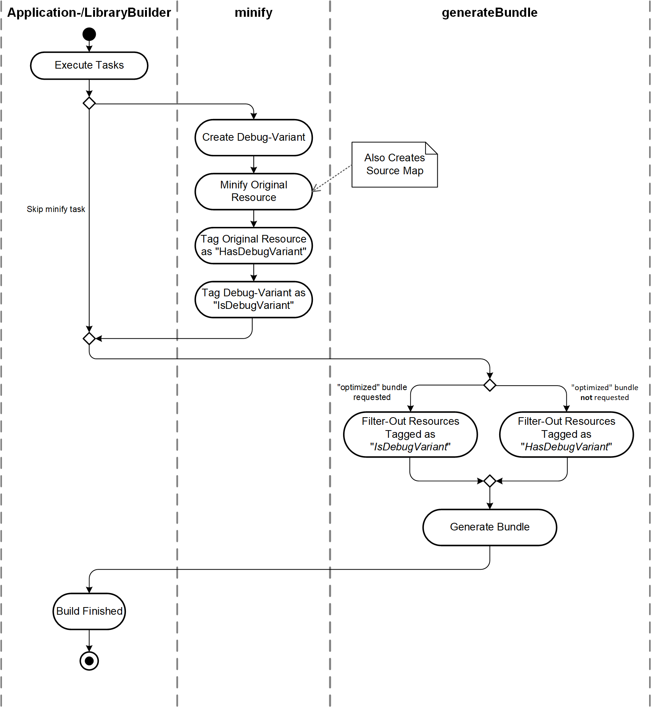
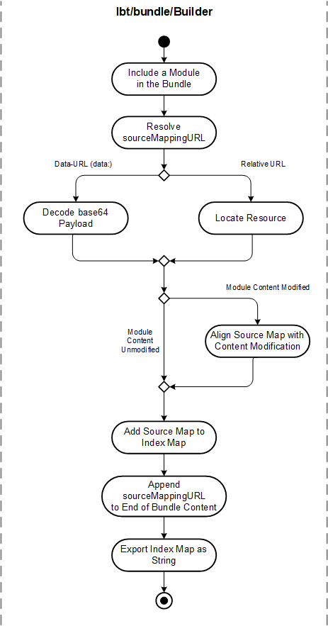

- Start Date: 2021-11-09
- RFC PR: [#583](https://github.com/SAP/ui5-tooling/pull/583)
- Issue: -
- Affected components <!-- Check affected components by writing an "X" into the brackets -->
    + [x] [ui5-builder](https://github.com/SAP/ui5-builder)
    + [ ] [ui5-server](https://github.com/SAP/ui5-server)
    + [ ] [ui5-cli](https://github.com/SAP/ui5-cli)
    + [x] [ui5-fs](https://github.com/SAP/ui5-fs)
    + [ ] [ui5-project](https://github.com/SAP/ui5-project)
    + [ ] [ui5-logger](https://github.com/SAP/ui5-logger)


# RFC 0010 UI5 Builder-Bundling Refactoring

## Summary

Refactor the bundle creation process of UI5 Tooling to make it more efficient and to provide new features.

## Motivation

The current bundling process is lacking in multiple aspects. The main pain points are as follows:

- *Efficiency:* **Minification** of resources is done as part of the bundling process, although the same resources are also minified in a following "uglify" task as part of the overall build process
- *Feature:* **Source maps** are neither generated nor are existing source maps used in a bundle resource
- *Issue:* The bundle process can't **differentiate between resources and their debug-variants** (i.e. `-dbg.js` files). In some cases this can lead to both resources being included in a bundle.

<!-- 
    Why are we doing this? What use cases does it support? What is the expected outcome?

    Please focus on explaining the motivation so that if this RFC is not accepted, the motivation could be used to develop alternative solutions. In other words, enumerate the constraints you are trying to solve without coupling them too closely to the solution you have in mind.
-->

## Detailed design

### Correct handling of debug-files

Depending on whether the requested bundle shall be "optimized", filter out all debug- or non-debug variants of resources. This is achieved by relying on resources being tagged with either "IsDebugVariant" or "HasDebugVariant", which is done by the task creating the debug variant.

These tags are shared in a "global" build context, so that they can also be accessed when working with resources of a dependency that has been built earlier.

#### `@ui5/fs.readers.Filter`

Filtering resources based on a tag can be achieved by enhancing on the [ReaderCollection](https://sap.github.io/ui5-tooling/api/module-@ui5_fs.ReaderCollection.html) concept of the UI5 FS. A new `filter()` API of the [AbstractReader](https://sap.github.io/ui5-tooling/api/module-@ui5_fs.AbstractReader.html) will provide a "reader.Filter" instance *(which also implements `AbstractReader`)*, wrapping the given reader instance. For every resource retrieved through this reader.Filter, a filter callback function is called, allowing filtering on tags or other parameters. 

This approach of filtering-out resources that should never be included in a specific bundle can also be used when exchanging the legacy-bundle-tooling with other tools like [Rollup](https://github.com/rollup/rollup), which also only expect the resources relevant for the bundle to be available.

**Signature:**
```javascript
/**
 * Filter constructor
 *
 * @param {object} parameters Parameters
 * @param {module:@ui5/fs.AbstractReader} parameters.reader A resource reader
 * @param {Function} parameters.filterCallback
 *          Filter function. Should return true for items to keep and false otherwise
 */

byPath(...)
byGlob(...)
```

**Example:**
```javascript
const filteredWorkspace = workspace.filter(function(resource) {
    return !taskUtil.getTag(resource, taskUtil.STANDARD_TAGS.IsDebugVariant);
});

const resources = await filteredWorkspace.byGlob("**"); // Won't return any resources tagged as "IsDebugVariant"
```

#### `@ui5/fs.readers.Transformer`

Bundles can also be configured as `optimize: false`. This should create a bundle consisting of files that have not been minified. One can invert the above Filter logic to exclude any minified files that have a debug variant (tagged as `HasDebugVariant`). However the remaining files will have the suffix `-dbg` (for example the unminified resources for `MyControl.js` is named `MyControl-dbg.js`). Depending on the bundle configuration, this naming difference can cause resources to incorrectly be in- or excluded from the bundle.

To solve this, an additional ReaderCollection concept is introduced in UI5 FS: A "Transformer". This 

**Signature:**
```javascript
/**
 * ReaderFilter constructor
 *
 * @param {object} parameters Parameters
 * @param {module:@ui5/fs.AbstractReader} parameters.reader A resource reader
 * @param {Function} parameters.filterCallback
 *          Filter function. Should return true for items to keep and false otherwise
 */

byPath(...)
byGlob(...)
```

**Example:**
```javascript
const filteredWorkspace = workspace.transform(function(resource) {
    return !taskUtil.getTag(resource, taskUtil.STANDARD_TAGS.IsDebugVariant);
});

const resources = await filteredWorkspace.byGlob("**"); // Won't return any resources tagged as "IsDebugVariant"
```

### Reorder- and reorganize build tasks
To make the above possible, the minification (a.k.a. "uglification") as well as the debug-file creation tasks need to be done before the bundling process. Only this allows the bundling to make use of the minified resources and the accompanying source maps.

**Create a new "minify" task** which takes care of creating a debug-variant, minifying the original resource (and creating a source map in the process) as well as tagging the resources as "IsDebugVariant" and "HasDebugVariant" accordingly.

**Deprecate the existing "uglify" and "createDebugFiles" tasks** in favor of this new task. Either remove them or make them a noop, so that custom tasks can still reference them in their "beforeTask" or "afterTask" configuration.

**"minify" Task Activity:**




### Source Map support

For every JavaScript resource that is being bundled, search for a "sourceMappingURL"-tag at the end of the file and try to load the referenced source map. For source maps located in separate files, this could look like `//# sourceMappingURL=DateFormat.js.map`. For inline source maps this might look like `//# sourceMappingURL=data:application/json;charset=utf-8;base64,eyJ3XZJka...`.

_**To be decided:** Also accept `//@` annotation? See [Conventions](http://sourcemaps.info/spec.html#h.lmz475t4mvbx) in the source map specification for details._

Any source maps found for a resource shall be added to the source map of the bundle. Either use an [index map](http://sourcemaps.info/spec.html#h.535es3xeprgt), containing the individual source maps, or generate a new source map for the whole bundle based off them.

In case bundled sources are modified (e.g. by adding characters), the relevant source map needs to be aligned with that change.

For resources where no source map is provided, the bundling process should not generate one. Since it doesn't heavily modify resources (as of today) and since for most resources a source map should be provided by the preceding minification process, we currently don't expect any need for this.

**Source Map Handling Activity:**




<!--
    This is the bulk of the RFC. Explain the design in enough detail for somebody familiar with the UI5 Tooling to understand, and for somebody familiar with the implementation to implement. This should get into specifics and corner-cases, and include examples of how the feature is used. Any new terminology should be defined here.
 -->

## How we teach this

The new "minify" tasks and the deprecation of the old "uglify" and "createDebugFiles" tasks should be documented in the ["Standard Tasks"](https://sap.github.io/ui5-tooling/pages/Builder/#standard-tasks) chapter of the Builder documentation.

Source map support should be documented in a separate chapter in the [Builder](https://sap.github.io/ui5-tooling/pages/Builder/) documentation. Especially with regards to further integration scenarios like projects that have already done a transpilation process (e.g. from TypeScript to JavaScript) and would like to provide us with source maps generated in the process.

The new `ReaderFilter` API should be documented in JSDoc. The signatures of the existing `generateBundle` tasks (including `generateComponentPreload` and `generateLibraryPreload`) should ideally stay the same, only adding an **optional** `taskUtil` parameter for filtering based on the mentioned tags. This allows for continued easy direct consumption of the tasks.

<!--
    What names and terminology work best for these concepts and why? How is this idea best presented?

    Would the acceptance of this proposal mean the UI5 Tooling or any of its sub-components documentation must be re-organized or altered?

    How should this feature be introduced and taught to existing UI5 Tooling users?
-->

## Drawbacks

To be discussed.

<!--
    Why should we not do this? Please consider the impact on teaching people to use the UI5 Tooling, on the integration of this feature with existing and planned features, on the impact of churn on existing users.

    There are trade-offs to choosing any path, please attempt to identify them here.
-->

## Alternatives

To be discussed.

<!-- What other designs have been considered? What is the impact of not doing this? -->

## Unresolved Questions and Bikeshedding
*This section should be removed (i.e. resolved) before merging*

Should we generate source maps during bundling if none is provided for a resource? This could be a simple mapping of only the first column of the first line to the original file.

### resourceRoot-mappings

When bundling modules via resourceRoot-mappings, it might become impossible to reference the original source from a bundle's source map. For example, for a bundle located in `/test-resources`, which includes modules from `/resources`, the source map must not reference the original module via `../../resources/x/y/z` as this path rather depends on the resourceRoot-mapping and might be different at runtime.

This could still be solved at a later time, once resourceRoot-mappings are actually supported by the general bundling process.

The actual impact of this behavior is uncritical, since it only causes affected source maps to not be found at runtime. The bundle itself as well as other source maps stay consistent.


### Mapping of static code at end of bundle

A "transient" source map needs to be generated for any statically generated "require"/"try-catch" code at the end of a bundle. The mapped' source needs to be defined in the "sourcesContent" field of the source map.

<!-- 
    Optional, but suggested for first drafts. What parts of the design are still TBD? Are there any second priority decisions left to be made?
-->

