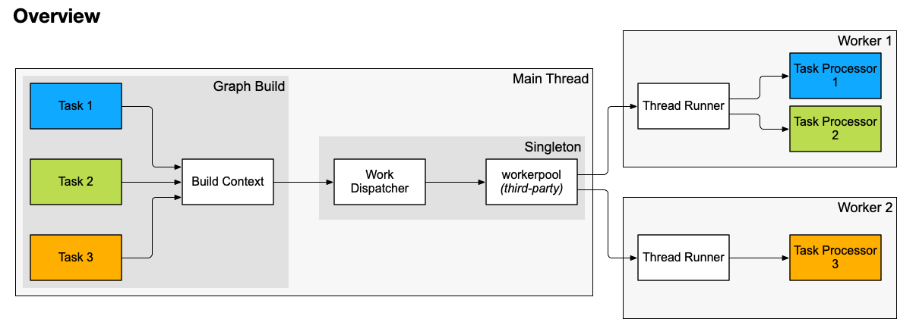

- Start Date: 2023-11-08
- RFC PR: [#897](https://github.com/SAP/ui5-tooling/pull/897)
- Issue: -
- Affected components <!-- Check affected components by writing an "X" into the brackets -->
    + [x] [ui5-builder](https://github.com/SAP/ui5-builder)
    + [ ] [ui5-server](https://github.com/SAP/ui5-server)
    + [ ] [ui5-cli](https://github.com/SAP/ui5-cli)
    + [ ] [ui5-fs](https://github.com/SAP/ui5-fs)
    + [x] [ui5-project](https://github.com/SAP/ui5-project)
    + [ ] [ui5-logger](https://github.com/SAP/ui5-logger)


# RFC 0014 Task Workers

## Summary
<!-- You can either remove the following explanatory text or move it into this comment for later reference -->

Concept for a new API provided to UI5 Tooling tasks, enabling easy use of Node.js [Worker Threads](https://nodejs.org/api/worker_threads.html) to execute CPU intensive operations outside of the main thread.

## Motivation
<!-- You can either remove the following explanatory text or move it into this comment for later reference -->

The two existing tasks `minify` and `buildThemes` should share the same pool of [workers](https://nodejs.org/api/worker_threads.html) so that there is no unnecessary teardown/startup of workers during a build.

The pool should also be re-used when multiple projects are being built, either in a `ui5 build --all` scenario, or concurrent project builds (as suggested in https://github.com/SAP/ui5-tooling/issues/894) within the same Node.js process to prevent creating multiple workerpools which might slow down the overall build or even system performance.

## Detailed design
<!-- You can either remove the following explanatory text or move it into this comment for later reference -->

### Terminology

* **`Worker`**: A Node.js [Worker thread](https://nodejs.org/api/worker_threads.html) instance
* **`Task`**: A UI5 Tooling task such as `minify` or `buildThemes` (both standard tasks) or any [custom task](https://sap.github.io/ui5-tooling/stable/pages/extensibility/CustomTasks/)
* **`Task Processor`**: A module associated with a UI5 Tooling task (standard or custom) that can be executed in a worker
* **`Build Context`**: An already existing ui5-project module, coupled to the lifecycle of a Graph Build. It shall be extended to provide access to the Work Dispatcher` by forwarding requests from tasks
* **`Thread Runner`**: A `@ui5/project` module that will be loaded in a worker. It handles communication with the main thread and executes a task processor on request
* **`Work Dispatcher`**: A `@ui5/project` singleton module which uses a library like [`workerpool`](https://github.com/josdejong/workerpool) to spawn and manage worker instances in order to have them execute any task processor requested by the task
    - Handles the worker lifecycle



### Key Design Decisions

* Task processors shall be invoked with a well defined signature as described [below](#task-processor)
* A task processor implementation should not be exposed to Worker-specific API
    - It should be possible to execute the task processor on the main thread as well as in a Worker
    - This would ultimately allow UI5 Tooling to dynamically decide whether to use Workers or not for a specific tasks
        + For example in CI environments where only one CPU core is available, the use of Workers might have a negative effect on the build time due to their overhead
        + Users might want to disable Workers to easily analyze and debug issues in processors
        + In some setups, the UI5 Tooling build itself might already be running in a Worker
* The "work dispatcher" and "thread runner" modules shall exclusively handle all inter-process communication
    - This includes serializing and de-serializing `@ui5/fs/Resource` instances
* Custom tasks may opt into this feature by defining one ore more "task processor" modules in their ui5.yaml configuration (see [Task Configuration](#task-configuration))
* A task can only invoke its own task processor(s)
* Neither the "work dispatcher" nor the "thread runner" modules shall have any knowledge regarding possible dependencies between workloads
    - Tasks are ultimately responsible for waiting on the completion of their invoked task processors
    - Tasks may invoke multiple task processors in parallel
    - The work dispatcher shall dispatch the workload in a first in, first out order
    - Task processors can finish in any order, and the result is supplied to the task immediately. Therefore a task processor might finish before or after another one that has been requested at a later time.
* A single Worker shall never execute more than one task processor at a time
* A task processors must be stateless

### Assumptions

* A task processor is assumed to utilize a single CPU thread by 90-100%
* A task processor is assumed to execute little to no I/O operations
* A task processor is assumed to make little use of UI5 Tooling modules other than those provided directly to the task processor

### Task Processor

[Processors](https://sap.github.io/ui5-tooling/stable/pages/Builder/#processors) are an established concept in UI5 Tooling but not yet exposed to custom tasks. The basic idea is that tasks act as the glue code that connects a more generic processor to UI5 Tooling. For example, UI5 Tooling processors make use of very little UI5 Tooling API, making them easily re-usable in different environments like plain Node.js scripts.

With this RFC, we extend this concept to custom tasks. A task can define one or more processors and execute them with a defined API. Their execution is managed by UI5 Tooling, which might execute them on the main thread or in a worker.

#### Input Parameters

* **`resources`**: An array of `@ui5/fs/Resource` provided by the task
* **`options`**: An object provided by the task
* **`fs`**: An optional fs-interface provided by the task
* **`log`**: A `@ui5/logger`-interface which sends any messages to the main thread for logging them there
* **`resourceFactory`** Specification-version dependent object providing helper functions to create and manage resources.
    - **`resourceFactory.createResource`** Creates a `@ui5/fs/Resource` (similar to [TaskUtil#resourceFactory.createResource](https://sap.github.io/ui5-tooling/stable/api/@ui5_project_build_helpers_TaskUtil.html#~resourceFactory))
    - No other API for now and now general "ProcessorUtil" or similar, since processors should remain as UI5 Tooling independent as possible

**_Potential future additions:_**
* _**`workspace`**: An optional workspace __reader__ provided by the task_
* _**`dependencies`**: An optional dependencies reader provided by the task_
* _**`reader`**: An optional generic reader provided by the task_

#### Return Values

The allowed return values are rather generic. But since UI5 Tooling needs to serialize and de-serialize the values while transferring them back to the main thread, there are some limitations.

The thread runner shall validate the **return value must be either**:
1. A value that adheres to the requirements stated in [Serializing Data](#serializing-data)
2. A flat object (`[undefined, Object].includes(value.constructor)`, to detect `Object.create(null)` and `{}`) with property values adhering to the requirements stated in [Serializing Data](#serializing-data)
3. An array (`Array.isArray(value)`) with values adhering to the requirements stated in [Serializing Data](#serializing-data)

Note that nested objects or nested arrays must not be allowed until we become aware of any demand for that.

Processors should be able to return primitives and `@ui5/fs/Resource` instances directly:
```js 
return createResource({
    path: "resource/path"
    string: "content"
});
````

It should also be possible to return simple objects with primitive values or `@ui5/fs/Resource` instances:

```js
return {
    code: "string",
    map: "string",
    counter: 3,
    someResource: createResource({
        path: "resource/path"
        string: "content"
    }),
}
```

Alternatively, processors might also return a lists of primitives or `@ui5/fs/Resource` instances:

```js
return [
    createResource({
        path: "resource/path"
        string: "content"
    }),
    createResource({
        path: "resource/path"
        string: "content"
    }),
    //...
]
```

#### Processor Example

```js
/**
 * Task Processor example
 *
 * @param {Object} parameters Parameters
 * @param {@ui5/fs/Resource[]} parameters.resources Array of resources provided by the task
 * @param {Object} parameters.options Options provided by the calling task
 * @param {@ui5/fs/fsInterface} parameters.fs [fs interface]{@link module:@ui5/fs/fsInterface}-like class that internally handles communication with the main thread
 * @param {@ui5/project/ProcessorLogger} parameters.log @ui5/logger-like instance for logging purposes
 * @param {@ui5/project/ProcessorResourceFactory} parameters.resourceFactory Helper object providing functions for creating and managing resources
 * @returns {Promise<object|Array|@ui5/fs/Resource|@ui5/fs/Resource[]>} Promise resolving with either a flat object containing Resource instances as values, or an array of Resources
 */
module.exports = function({resources, options, fs, log, resourceFactory}) {
    // [...]
};
````

### Task Configuration

```yaml
specVersion: "3.3"
kind: extension
type: task
metadata:
    name: pi
task:
    path: lib/tasks/pi.js

    # Option 1
    processors:
        computePi: lib/tasks/piProcessor.js

    # Option 2
    processors:
        - name: computePi
          path: lib/tasks/piProcessor.js


    # Option 3
    processors:
        computePi:
          path: lib/tasks/piProcessor.js

    # Option 4: Make this configuration part of the task? See below
```

Another alternative would be programmatic configuration like this:

```js
// Option 4
export const processors = {
    computePi: {
        path: "../piProcessor.js"
    }
};
```

Option 1 does not allow for introducing additional per-processor configuration in the future (e.g. max CPU threads, priority, etc.). Option 4 can't make use of the existing schema validation of ui5.yaml-based configuration.

Option 3 is very similar to the configuration of the task itself.

**Decision:** Go with **Option 3**.

### Task API

Tasks defining processors in their `ui5.yaml` configuration shall be provided with a new `processors` object, allowing them to trigger execution of the configured processors.

The `processors.execute` function shall accept the following parameters:
* `resources` _(optional)_: Array of `@ui5/fs/Resource` instances if required by the processor
* `options` _(optional)_: An object with configuration for the processor. 
* `reader` _(optional)_: An instance of `@ui5/fs/AbstractReader` which will be used to read resources requested by the task processor. If supplied, the task processor will be provided with a `fs` parameter to read those resources

The `execute` function shall validate that `resources` only contains `@ui5/fs/Resource` instances and that `options` adheres to the requirements stated in [Serializing Data](#serializing-data).

#### Task Example

```js
/**
 * Custom task example
 *
 * @param {Object} parameters Parameters
 * @param {DuplexCollection} parameters.workspace DuplexCollection to read and write files
 * @param {AbstractReader} parameters.dependencies Reader or Collection to read dependency files
 * @param {@ui5/project/build/helpers/TaskUtil|object} [parameters.taskUtil] TaskUtil
 * @param {object} processors
 * @param {Object} parameters.options Options
 * @param {string} parameters.options.projectName Project name
 * @param {string} [parameters.options.configuration] Task configuration if given in ui5.yaml
 * @returns {Promise<undefined>} Promise resolving with undefined once data has been written
 */
export default async function({workspace, taskUtil, processors, options}) {
    const res = await processors.execute("computePi", {
        resources: [workspace.byPath("/already-computed.txt")] // Input resources
        options: { // Processor configuration
            digits: 1_000_000_000_000_000_000_000
        },
        reader: workspace // To allow the processor to read additional files if necessary
    });
    await workspace.write(res);
   // [...] 
};
````

Additional helper functions should be provided to create objects that can be supplied for the `taskUtil` and `processors` parameters when using the task outside UI5 Tooling.

### Serializing Data

In order to ensure all data supplied to- and returned from- a processor can be serialized correctly, the following checks must be implemented:

In case of an object, all property values and in case of an array, all values must be either [**primitives**](https://developer.mozilla.org/en-US/docs/Glossary/Primitive) (except `symbol`?) or **`@ui5/fs/Resource`** instances (do not use `instanceof` checks since Resource instances might differ depending on the specification version).

Note: Instances of `@ui5/fs/Resource` might loose their original `stat` value since it is not fully serializable. Any serializable information will be preserved however.

## How we teach this
<!-- You can either remove the following explanatory text or move it into this comment for later reference -->

* Documentation for custom task developers on how to decide whether a task should use processors or not. For instance depending on their CPU demand

## Drawbacks
<!-- You can either remove the following explanatory text or move it into this comment for later reference -->

**TODO**

## Alternatives
<!-- You can either remove the following explanatory text or move it into this comment for later reference -->

**TODO**

## Unresolved Questions and Bikeshedding
<!-- You can either remove the following explanatory text or move it into this comment for later reference -->

*This section should be removed (i.e. resolved) before merging*

**TODO**
