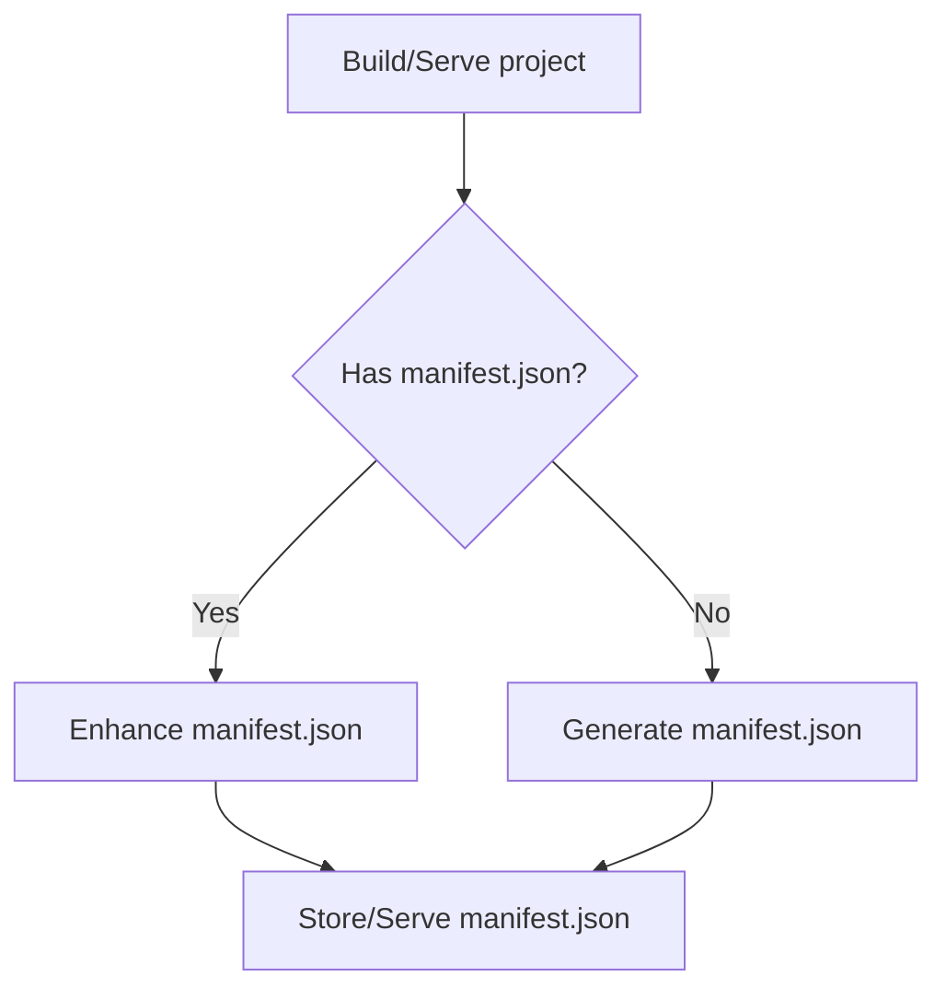

- Start Date: 2024-04-16
- RFC PR: [#946](https://github.com/SAP/ui5-tooling/pull/946)
- Issue: -
- Affected components <!-- Check affected components by writing an "X" into the brackets -->
    + [x] [ui5-builder](https://github.com/SAP/ui5-builder)
    + [x] [ui5-server](https://github.com/SAP/ui5-server)
    + [ ] [ui5-cli](https://github.com/SAP/ui5-cli)
    + [ ] [ui5-fs](https://github.com/SAP/ui5-fs)
    + [ ] [ui5-project](https://github.com/SAP/ui5-project)
    + [ ] [ui5-logger](https://github.com/SAP/ui5-logger)

# RFC 0016 Library Source Manifest

## Summary
<!-- You can either remove the following explanatory text or move it into this comment for later reference -->

Enable (and eventually encourage) UI5 libraries to place a manifest.json in their source while preserving any features of the dynamic manifest creation currently in place.

## Motivation
<!-- You can either remove the following explanatory text or move it into this comment for later reference -->

The manifest.json file is _important_ for the UI5 runtime, and it's absence can lead to unexpected fallback- and default behavior.

Applications are already required to either contain a manifest.json or the alternative manifest.appdescr_variant. This requirement is mainly enforced by UI5 Tooling which uses the file to determine the application's **namespace**.

For libraries however, the presence of a manifest.json is currently optional. Required information like the namespace can alternatively be defined in a .library-XML file or, if that does not exist either, derived from the path of a library.js file (which is required by UI5 runtime and therefore always present). A UI5 Tooling build task "generateManifest" exists to generate a missing manifest.json during the build using information from the .library file.

Our estimate is that currently the majority of UI5 libraries **do not contain a manifest.json file**, with only recently created third-party libraries which may provide the file.

On the other hand however, all UI5-framework libraries as well as most third-party libraries contain a .library file.

With evolving APIs in the UI5 runtime, the absence of a manifest.json becomes more of a problem in the future. Therefore we need to find ways to ensure that the UI5 runtime can rely on the presence of the file.

## Detailed design
<!-- You can either remove the following explanatory text or move it into this comment for later reference -->

To solve this we intent to implement two plans:
1. Add dynamic manifest generation to ui5-server
    * Reusing the existing processor of ui5-builder
    * This will ensure that a manifest.json is present at development-time for most of today's libraries
2. Implement a new component in ui5-builder and ui5-server to dynamically enhance existing manifest.json
    * Reusing what is already being done for `supportedLocales` in https://github.com/SAP/ui5-builder/pull/957
    * Without this, developers might be discouraged to have a static manifest.json since the dynamic generation would take care of collecting and defining dynamic information like the supported locales and -themes

### Dynamic Manifest Properties

The following properties contain "dynamic information", which should be filled by either the manifest generation or enhancement process.

Of course a developer should always be able to define any of them statically in the manifest.json, in which case they are not overwritten.

* supported locales (manifest enricher)
* supportedThemes (manifest enricher)
* minUi5Version (manifest enricher)
* minUi5Version of dependencies (manifest enricher, if deps are available)
* library.content (manifest enricher, like manifestCreator)
	* Note future runtime might only require interface-information
* openSourceComponents (manifest enricher, from .library)
* version (should only contain a placeholder) (placeholder replacement)

### Examples Resources

https://ui5.sap.com/resources/sap/esh/search/ui/manifest.json
https://ui5.sap.com/resources/sap/esh/search/ui/.library

## How we teach this
<!-- You can either remove the following explanatory text or move it into this comment for later reference -->

tbd

## Drawbacks
<!-- You can either remove the following explanatory text or move it into this comment for later reference -->

tbd

## Alternatives
<!-- You can either remove the following explanatory text or move it into this comment for later reference -->

tbd

## Unresolved Questions and Bikeshedding
<!-- You can either remove the following explanatory text or move it into this comment for later reference -->

-
