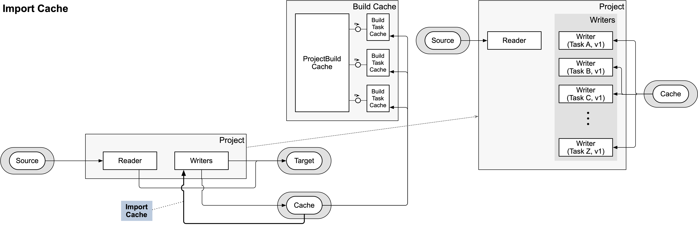

- Start Date: 2024-12-09
- RFC PR: [#1036](https://github.com/SAP/ui5-tooling/pull/1036)
- Issue: -
- Affected components <!-- Check affected components by writing an "X" into the brackets -->
	+ [x] [ui5-builder](https://github.com/SAP/ui5-builder)
	+ [x] [ui5-server](https://github.com/SAP/ui5-server)
	+ [x] [ui5-cli](https://github.com/SAP/ui5-cli)
	+ [x] [ui5-fs](https://github.com/SAP/ui5-fs)
	+ [x] [ui5-project](https://github.com/SAP/ui5-project)
	+ [x] [ui5-logger](https://github.com/SAP/ui5-logger)


# RFC 0017 Incremental Build

## Summary

This concept aims at adding incremental build support to UI5 Tooling. It should be possible to execute a build where only a small set of modified resources is re-processed while the rest is reused from a previous build.

## Motivation

The current build process is slow, especially for large projects. This is because on every build all resources of a project need to be processed. However, this is often not necessary, since only few resources might have been changed between builds. An incremental build would detect those changes and only process resources where needed, reusing previous build results. This should speed up the build process significantly.

It has also become increasingly common for UI5 projects to use [custom build tasks](https://sap.github.io/ui5-tooling/stable/pages/extensibility/CustomTasks/). Examples include custom tasks for TypeScript compilation, or for consuming third-party libraries.

These tasks can greatly enhance the development experience with UI5. However, when working on projects that depend on projects using such custom tasks, it can become cumbersome to set up a good development environment. This is because the current UI5 Tooling server does not execute custom tasks (or any tasks at all), and instead relies on [custom middleware](https://sap.github.io/ui5-tooling/stable/pages/extensibility/CustomServerMiddleware/) for things like the mentioned examples.

However, only custom middleware defined for the current root project is used by the server. This means that the root project often needs to configure custom middleware *for its dependencies*.

By enhancing the UI5 Tooling server to execute build tasks before serving a project's resources, this problem can be solved. And by making use of an incremental build feature, the server can efficiently re-process resources when needed, hopefully preventing negative impacts on the server's performance.

## Detailed design

### Current Build

The current build process executes all build tasks for the required projects one by one. Tasks are reading and writing resources from- and to a `workspace` entity, which is a representation of the virtual file system of `@ui5/fs` for the current project. A `workspace` currently consists of a `reader` and a `writer`. The reader is usually connected to the sources of the project and the writer is an in-memory object, collecting the output of the build tasks before it is finally written to the target output directory.

This setup allows a build task to always access to the result of a previous task, which may have altered a source file or added additional resources.


### Incremental Build Cache

For the incremental build cache feature, a new entity `Build Task Cache` shall be created, which is managed by a `Project Build Cache`. In addition, the current concept of the project-`workspace` shall be extended to allow for `writer stages`. These stages build upon each other. Essentially, instead of one writer being shared across all tasks, each task is assigned it's own writer stage. And each task reads from the combined stages of the preceding tasks.

This shall enable the following workflow:

1. **Action:** Build is started
1. Task A, Task B and Task C are executed in sequence, writing their results into individual writer stages.
1. *The writer stages and `cache-info.json` are serialized onto disk.*
1. Build finishes and the resources of all writer stages and the source reader are combined and written into the target output directory.
    * Resources present in later writer stages (and higher versions) are preferred over competing resources with the same path.
1. **Action:** A source file is modified and a new build is triggered
1. *The `cache-info.json` is read from disk and the writer stages are imported into the project instance.*
1. The build determines which tasks need to be executed using the imported cache and information about the modified source file.
    * In this example, it is determined that Task A and Task C need to be executed since they requested the modified resource in their previous execution.
1. Task A is executed. The output is written into a new **version** (v2) of the associated writer stage.
    * The task is given access to a new `cache` parameter, allowing it to access cache related information, such as which resources have changed since the task's last execution.
    * Based on that, Task A may decide to only process the changed resources and ignore the others.
    * Task A can't access v1 of its writer stage. It can only access the combined resources of all previous writer stages.
1. The `Project Build Cache` determines whether the resources produced in this latest execution of Task A are relevant for Task B. If yes, the content of those resources is compared to the cached content of the resources Task B has received during its last execution. In this example, the output of Task A is not relevant for Task B and it is skipped.
1. Task C is called and has access to both versions (v1 and v2) of the writer stage of Task A. Allowing it to access all resources produced in all previous execution of Task A.
1. *Writer stages and `cache-info.json` are serialized onto disk.*
1. The build finishes. The combined resources of all writer stages and the source reader are written to the target output directory.


### Cache Creation

The build cache shall be serialized onto disk in order to use it in successive UI5 Tooling executions. A standardized directory should be used for this, so that UI5 Tooling can automatically find and use the cache.

Every project has its own cache. This allows for reuse of a project's cache across multiple consuming projects. For example, the `sap.ui.core` library could be built once and the build cache can then be reused in the build of multiple applications.

The cache consists of a `cache-info.json` file with the below data structure and and multiple directories with the serialized writer stages.

#### cache-info.json

````json
{
	"timestamp": 1734005532124,
	"cacheKey": "project-name-1.0.0-bb3a3262d893fcb9adf16bff63f",
	"taskCache": [{
		"taskName": "replaceCopyright",
		"resourceMetadata": {
			"projectRequests": {
				"pathsRead": [],
				"patterns": [
					"/**/*.{js,library,css,less,theme,html}"
				]
			},
			"dependencyRequests": {
				"pathsRead": [],
				"patterns": []
			},
			"resourcesRead": {
				"/resources/project/namespace/Component.js": {
					"md5": "d41d8cd98f00b204e9899998ecf8427e",
					"lastModified": 1734005532120
				}
			},
			"resourcesWritten": {
				"/resources/project/namespace/Component.js": {
					"md5": "c1c77edc5c689a471b12fe8ba79c51d1",
					"lastModified": 1734005532120
				}
			}
		}
	}],
	"sourceMetadata": {
		"/resources/project/namespace/Component.js": {
			"md5": "d41d8cd98f00b204e9800998ecf8427e",
			"lastModified": 1734005532120
		}
	}
}
````

**cacheKey**

The cache key can be used to identify the cache. It shall be based on the project's name and version as well as a SHA-256 hash of the versions of the relevant UI5 Tooling modules (`@ui5/project`, `@ui5/builder`
`@ui5/fs`), the names and versions of the project's dependencies and the current build configuration (ui5.yaml + CLI parameters). This shall allow the UI5 Tooling to determine whether the cache is still valid or not.

**taskCache**

An array of objects, each representing a task that was executed during the build. The object contains the name of the task, the project resources that were read and written by the task, and the resources that were read from the project's dependencies. If the task used globs patterns to read resources, those patterns are stored instead of the resolved paths so that the pattern can later be matched against newly created resources that might invalidate the task.

For each resource that has been read or written, the SHA256 hash of the content and the timestamp of last modification are stored. This allows the UI5 Tooling to determine whether the resource has changed since the last build and whether the task cache is still valid.

**sourceMetadata**

For each *source* file of the project, the SHA256 hash of the content and the timestamp of last modification are stored. This allows the UI5 Tooling to determine whether the source files have changed since the last build.

#### Cache directory structure

```
.ui5-cache
├── openui5-sample-app-0.5.0-bb0a3262d093fcb9acf16
│    ├── cache-info.json
│    └── taskCache
│         ├── 0-escapeNonAsciiCharacters
│         │    └── resources
│         ├── 3-minify
│         │    └── resources
│         ├── 4-enhanceManifest
│         │    └── resources
│         └── 6-generateComponentPreload
│              └── resources
├── sap.m-1.132.0-SNAPSHOT-bb0a3262d093fcb9acf16
│    ├── cache-info.json
│    └── taskCache
│         ├── 0-escapeNonAsciiCharacters
│         │    └── test-resources
│         ├── 1-replaceCopyright
│         │    ├── resources
│         │    └── test-resources
│         ├── 2-replaceVersion
│         │    └── resources
│         ├── 4-minify
│         │    └── resources
│         ├── 5-generateLibraryManifest
│         │    └── resources
│         ├── 7-generateLibraryPreload
│         │    └── resources
│         └── 8-buildThemes
│              └── resources
└── sap.ui.core-1.132.0-SNAPSHOT-bb0a3262d093fcb9acf16
     ├── cache-info.json
     └── taskCache
          ├── 0-escapeNonAsciiCharacters
          │    └── test-resources
          ├── 1-replaceCopyright
          │    ├── resources
          │    └── test-resources
          ├── 2-replaceVersion
          │    ├── resources
          │    └── test-resources
          ├── 3-replaceBuildtime
          │    └── resources
          ├── 4-minify
          │    └── resources
          ├── 5-generateLibraryManifest
          │    └── resources
          ├── 7-generateLibraryPreload
          │    └── resources
          ├── 8-generateBundle
          │    └── resources
          └── 9-buildThemes
               └── resources
```

The directories inside `taskCache/` shall each represent a writer stage, prefixed by an integer number reflecting the order of creation in the build. The directories contain all resources that have been *written* by the task associated with that stage.


### Cache Import

Before building a project, UI5 Tooling shall scan for a cache directory with the respective cache key and import the cache if one is found. 

The import process mainly populates the `Build Task Cache` instances with the information from the `cache-info.json` file and creates readers for the individual `taskCache` directories (representing the writers of each task's previous execution). Those readers are then set as the initial version (v1) writer stages in the corresponding `Project` instance.

This allows executing individual tasks and provide them with the results of all tasks that would normally have been executed before them. Also, the task can decide to only process a few changed resources while the build result will still contain all resources that were written by any of the the task's previous executions.



### Cache Invalidation

The following diagram shows the process for determining whether a project needs to be (partially) rebuilt and if yes, which individual tasks need to be (re-)executed.

Note this important differentiation: A Build Task Cache can be *potentially* or *definitely* invalidated. It is *potentially* invalidated if the corresponding task read resources that have been modified since the last build. It is *definitely* invalidated if the content of those resources has actually changed. By only potentially invalidating a Build Task Cache the current process does not have to ensure that the resources actually changed at this point in time. Comparing the content of resources can be deferred until the task is actually executed. This can save time, especially since the resource in question might be modified again before the potentially invalidated task is executed.

If the task ends up being executed, it might produce new resources. After the execution has finished and the new resources have been written to the writer stage, it should be checked whether the content of those resources has actually changed right away. If not, they must not lead to the invalidation of any following tasks. If they have changed, the relevant Build Task Cache instances will be notified about the changed resources and might *potentially* invalidate themselves.

After a *project* has finished building, a list of all the modified resource is compiled and passed to the `Project Build Cache` instances of all depending projects (i.e. projects that depend on the current project and therefore might use the modified resources).


### Task Purging

**TOOD** A mechanism to purge unused cache on disk is required. The cache can grow very large and consume a lot of disk space. The latest PoC produced cache entries with a size ranging from few kilobytes for applications up to 70 MB for framework libraries like sap.ui.core or sap.m.

This should probably use some sort of LRU-cache to purge unused cache entries dynamically. The same mechanism could be applied to the npm artifacts downloaded by UI5 Tooling.

### Watch Mode

The build API should provide a "watch" mode that will re-trigger the build when a source file is modified. The watch mode shall select the projects to watch based on which projects have been requested to be built. If a [UI5 Tooling workspace](https://sap.github.io/ui5-tooling/stable/pages/Workspace/) is used, this can be fine-tuned in the workspace configuration.

### Server Integration

The UI5 Tooling server shall integrate the incremental build as a mean to pre-process projects before serving the build result. It shall use the watch mode to automatically rebuild the projects when source files are modified, so that always the latest resources are served.

Middleware like `serveThemes` (used for compiling LESS resources to CSS) would become obsolete with this, since the `buildThemes` task will be executed instead.

If any project (root or dependency) configures custom tasks, those tasks are executed in the server as well. This makes it possible to easily integrate projects with custom tasks as dependencies.

Since executing a full build requires more time than the on-the-fly processing of resources currently implemented in the UI5 Tooling server, users shall be able to disable individual tasks that are not necessarily needed during development. This can be done using CLI parameters as well as ui5.yaml configuration.

## How we teach this

This is a big change in the UI5 Tooling architecture and especially impacts the way the UI5 Tooling server works. By always building projects, developers might experience a slower startup time of the server. After modifying a file, it might also take longer until all processing is finished and the change is being served to the browser.

The incremental build hopefully mitigates this performance impact to some extend. The ability to disable individual tasks can further improve the performance again. However this needs to be taught to developers and sane defaults should be picked to make the experience as good as possible.

With the execution of tasks in the server, some (custom) middleware might become obsolete or even cause problems. This means that **projects might need to adapt their configuration**.

All of this should be communicated in the UI5 Tooling documentation and in blog posts. A phase of pre-releases should be used to gather feedback from the community.

## Drawbacks

* For every file change, the server needs to execute a partial build. This can lead to a longer time between making a source file change and seeing the result in the browser.
	* This should be measured on different systems. The project size and the used tasks can have a big impact on the performance.
	* The ability to disable individual tasks for the server can help to mitigate this problem.
		* Would this create a distinction between tasks that are relevant for the production build only and those relevant to the server only?
* Projects might have to adapt their configurations
* Custom tasks might need to be adapted. Before they could only access the sources of a project. With this change, they will access the build result instead. Access to the sources is still possible but requires the use of a dedicated API
* UI5 Tooling standard tasks need to be adapted to use the new cache API. Especially the bundling tasks currently have no concept for partially re-creating bundles. However, this is an essential requirement to achieve fast incremental builds.
* The project build cache might become very large and consume a lot of disk space. On systems with restricted disk space or slow I/O operations, this could lead to a worse performance.

## Alternatives

An alternative to using the incremental build in the UI5 Tooling server would be to apply custom middleware of dependencies.

## Unresolved Questions and Bikeshedding

* Adapt tasks to use new cache API
* Clarify cache key 
    * Current POC: project version + dependency versions + build config + UI5 Tooling module versions
* How to distinguish from pre-built projects (with project manifest)
* Pre-built UI5 libraries become especially important with this concept. Otherwise consumers will always have to build framework libraries, even in the server
* Include resource tags in cache
* Measure performance in BAS
* Compress cache to reduce memory pressure
* Allow tasks to store additional information in the cache
* Some tasks might be relevant for the server only (e.g. code coverage)
* What if a task ceases to create a resource because of a change in another resource? The previously create version of the resource would still be used from the cache
* Test with current custom tasks
