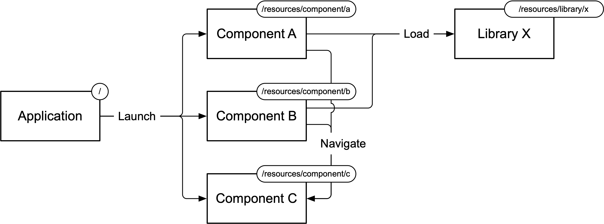

- Start Date: 2025-07-15
- RFC PR: [#1083](https://github.com/SAP/ui5-tooling/pull/1083)
- Issue: [#45](https://github.com/SAP/ui5-tooling/issues/45)
- Affected components
    + [ ] [ui5-builder](https://github.com/SAP/ui5-builder)
    + [ ] [ui5-server](https://github.com/SAP/ui5-server)
    + [ ] [ui5-cli](https://github.com/SAP/ui5-cli)
    + [ ] [ui5-fs](https://github.com/SAP/ui5-fs)
    + [x] [ui5-project](https://github.com/SAP/ui5-project)
    + [ ] [ui5-logger](https://github.com/SAP/ui5-logger)

# RFC 0018 Component Type

## Summary

The "component" type feature aims to introduce a new project type within the UI5 Tooling ecosystem to support the development of UI5 component-like applications intended to run in container apps such as the Fiori Launchpad (FLP) Sandbox or testsuite environments.

This feature will allow developers to serve and build multiple UI5 application components concurrently, enhancing the local development environment for integration scenarios.

## Motivation

Currently, the UI5 Tooling requires a project's dependency tree to contain either zero or exactly one project of type "application" which also must be the root project. This limitation restricts the ability to serve or build multiple component-like applications simultaneously, which is a common requirement in UI5 development, especially in cases where cross-application integration is required.

The introduction of a dedicated "component" type will facilitate local development and testing of these multi-component applications by clearly distinguishing them from the root application.

## Detailed design

The new "component" type will borrow characteristics from both, the existing "application" type as well as the "library" type. The build tasks to be executed will be almost identical to the "application" type, while the handling for multiple dependencies and their namespaces will be borrowed from the "library" type.

The above diagram illustrates a common scenario where multiple UI5 components are developed and tested concurrently. Each component is represented as a separate project with its own namespace, allowing them to coexist without conflicts. The "component" type will enable these projects to be served and built independently while still being able to reference each other, for example for the purpose of navigating between them.

### Key design aspects include:

* **Serving Path:** Unlike ["application" projects](https://sap.github.io/ui5-tooling/stable/pages/Project/#application) served at the root path "/", "component" projects will be served under their namespace, for example, "/resources/my/bookstore/admin". This enables multiple component projects to coexist alongside a single root application (like in the FLP).
* **Folder Structure:** Similar to the "library" type, "component" projects may use a flat folder structure or a namespace structure. In case of a flat structure, the project namespace will be derived from the manifest.json "sap.app".id property.
* **Entry Point:** Component projects will not have a dedicated `index.html` in their regular resources (like application-type projects often do). They can still be run standalone though. For instance via a dedicated HTML-site located in their test-resources, or by declaring a development-dependency to an application-type project which is capable of serving the component.
* **Build Options:** The "component" type will support [all output-styles](https://sap.github.io/ui5-tooling/stable/pages/Project/#build-output-style) that are currently supported by library projects, ensuring compatibility with current deployment practices where namespaces may need to be omitted in the directory structure ("flat" output style).

### Project Structure

A component type project must contain both, a `Component.js` and a `manifest.json` file.

### Specification Version

The new component type shall be released together with a new [Specification Version](https://sap.github.io/ui5-tooling/stable/pages/Configuration/#specification-versions) which will be required for using the new type. This ensures that old versions of the UI5 CLI encountering this new type will gracefully fail due to the unsupported Specification Version, informing the user to upgrade to the latest UI5 CLI.

## How we teach this

The introduction of the "component" type requires updates to the UI5 Tooling documentation. Specific focus should be given on illustrating the distinctions between "application" and "component" types and guiding users on selecting the appropriate type for different development scenarios.

Dedicated guides should be offered to help users adopt the new component type, especially in existing projects where component-libraries, proxy setups or similar workarounds are currently being used.

## Drawbacks

Potential drawbacks include increased complexity for developers to distinguish between application and component types. However, as outlined in the alternatives, this approach is intended to create _the least_ complexity of all considered options.

## Alternatives

Alternatives considered include enhancing the "application" type to support serving multiple applications simultaneously, or introducing generic "shell" functionality in UI5 Tooling, negating the need for a new "component" type. By choosing not to go forward with these alternatives, and instead introducing the proposed "component" type, UI5 Tooling will stay consistent with the current concept of application-type projects acting as the single point of entry and introduce a new type that is consistent with the expectations of a UI5 application component. This should make it easy to understand the purpose and usage of each project type and reduce complexity in the configurations of projects.

## Unresolved Questions and Bikeshedding

* The exact impact of Fiori Tools' proxy solutions on custom middleware integration within UI5 projects and whether further tooling enhancements will be required.
* How well current workarounds can be replaced by this new type, and whether additional features or adjustments are needed to fully support existing use cases.
    * Component-libraries (library-type projects containing multiple components)
        * Example: [github.com/flovogt/ui5-nested-component-scenario - main branch](https://github.com/flovogt/ui5-nested-component-scenario/)
        * Successfully migrated to component type: [github.com/flovogt/ui5-nested-component-scenario - demo-use-component-type branch](https://github.com/flovogt/ui5-nested-component-scenario/tree/demo-use-component-type)
    * Community extension ["ui5-middleware-ui5"](https://github.com/ui5-community/ui5-ecosystem-showcase/tree/main/packages/ui5-middleware-ui5)
    * Custom proxy setups
